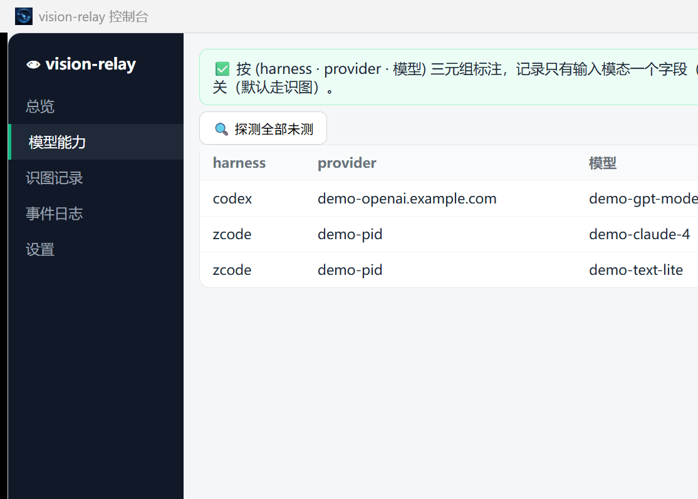
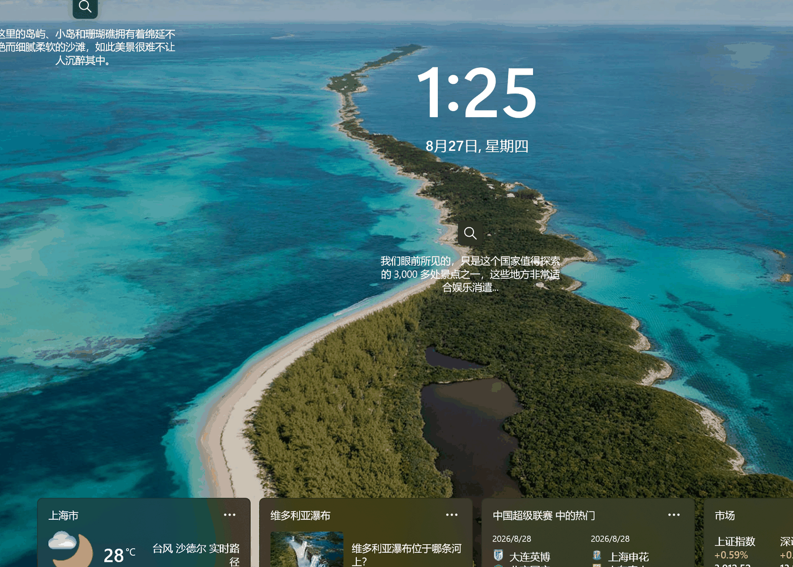
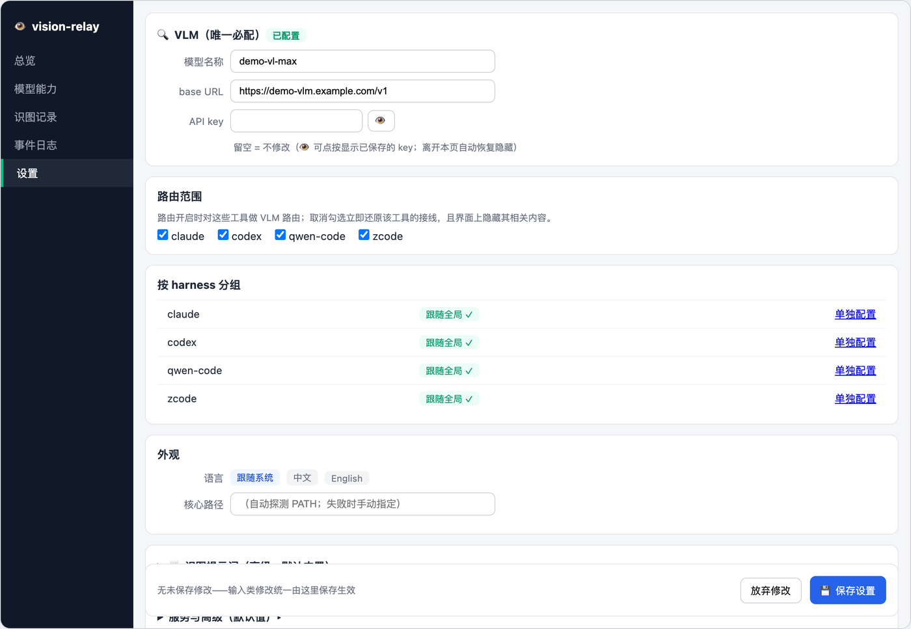

# vision-relay

[English](README.md) · **中文**

一个架设在 **agent harness 边界的透明 HTTP 代理**,让**纯文本模型**拥有视觉能力。它在你的 harness base_url 前面,拦截 Anthropic / Responses / Chat 三类请求里的图片,交给视觉语言模型(VLM)转述为文字,再**把文本转发(relay)给真正的上游文本模型**。

上游永远只看到文本——所以无需任何 skill / 插件 / 工具,纯文本模型就能"看图"。它以**驻留式 HTTP 服务**形式运行(不是 Skill + MCP server)。**一套代码覆盖 Claude Code / Codex / Qwen Code / zcode 四家 harness:装一次,全部接管。**

## 为什么是 vision-relay?

给纯文本模型加视觉,常见有两条路线,表面相似实则架构完全不同。本项目属于第三条:

| | Skill / 工具型(模型主动调用) | 纯透明代理 | **vision-relay(本项目)** |
|---|---|---|---|
| 做法 | 给 harness 塞一个 skill/tool,靠模型*记得*去调用 | 拦截 base_url,但只抓包 / 转协议 | 在 base_url 拦截**整个请求流**,并**改写请求内容** |
| 谁决定用 | 模型(它可能忘) | 无差别拦截 | **你在配置时定一次** |
| 图片处理 | 模型把图传给工具 | 只观察,不处理 | **图片被转述成文本并注入**,再转发 |
| 透明性 | 对模型不透明,需提示 | 透明,但不增值 | **完全透明 + 有增值**(模型无感,图片变文本) |
| 上游所见 | 文本模型看到工具返回的任意结果 | 文本模型看到原始(可能含图)流 | **文本模型永远只见文本** |
| 跨 harness 通用性 | 每家各写一套 | 理论通用但不增值 | **一套代码四家通用**:协议归一化与图片安全网只写一次,接新工具只加一层外壳 |
| 失败兜底 | 无 | 不处理 | **fail-open**:VLM 故障时注入可读说明文本,绝不 400 / 死锁 |
| 成本 | 每次调用都可能转述 | — | **Tier1 / Tier2 两层缓存 + TTL + 上下文预算**:同一张图不重复调 VLM,大图不撑爆上下文 |

开源里你能搜到的同类(`visual-proxy`、`codex-vision-proxy`、`vision-bridge-mcp`、`cc-inspector`、`anthroproxy`)大多落在最**左**(Skill/工具)或最**中**(纯代理)两列。
**vision-relay 把"透明拦截 + 图片转述"两者结合**——这种组合在开源里很罕见。

## 界面速览

装完即用的桌面控制台——路由开关与逐 harness 实时拓扑、实测背书的模型能力矩阵、识图三段留痕、只读诊断 + 自动修复,五个页签管完,随桌面安装包一起分发。

|  |  |
|:---:|:---:|
| **总览** | **模型能力** |
|  |  |
| **识图记录** | **设置** |

每个页签能点什么、展示什么——[逐页签使用手册](#桌面控制台gui)在下方。

## 工作原理

```
   [ Agent harness ]      Claude Code / Codex / Qwen Code / zcode
        |  base_url -> 127.0.0.1:8787
        v
   [ vision-relay ]
      /        \
 图片       纯文本
    /            \
   v              v
  [ VLM ]    [ 上游文本模型 ]       relay: chat / responses / anthropic
  (转述)
```

已在用 CC Switch / Codex++ 这类本地路由工具?不用改习惯——vision-relay 做第一跳,工具作下游 relay(两层路由,[配置与进阶](#配置与进阶)有模板)。

## 安装

**桌面应用（推荐）** — 从 [Releases](https://github.com/jarvislee90s-dot/vision-relay/releases) 下载安装包：

| 平台 | 产物 |
|---|---|
| Windows x64 | `vision-relay-<版本>-win-x64-setup.exe` |
| macOS（Apple Silicon） | `vision-relay-<版本>-macos-arm64.dmg` |
| Linux x64 | `vision-relay-<版本>-linux-x64.AppImage` / `.deb` |

零 Python 依赖——核心已冻结内嵌,装完即用。

> **🍎 macOS 首次打开**:应用未购 Apple 开发者计划公证,双击会弹「"vision-relay"已损坏」——文件没坏,是 Gatekeeper 对网络下载未公证应用的统一措辞。拖入「应用程序」后在终端执行一次:
>
> ```bash
> xattr -cr /Applications/vision-relay.app
> ```
>
> 之后正常打开;每个新版本安装后需再执行一次。

**pip（高级 / 无界面场景）**:

```bash
pip install vision-relay
```

或从源码 checkout:

```bash
python3 -m venv .venv
source .venv/bin/activate
python -m pip install -e .
python -m pip install pytest httpx
```

**Windows(PowerShell)** 从源码 checkout 时,`source .venv/bin/activate` 是 Unix 写法,在 PowerShell 里会报错。用下面的命令(用 `py` 或 `python`,不是 `python3`;激活脚本在 `Scripts\` 下):

```powershell
py -3 -m venv .venv
.venv\Scripts\Activate.ps1   # 若提示禁止运行脚本,先执行:  Set-ExecutionPolicy -Scope CurrentUser RemoteSigned
python -m pip install -e .
python -m pip install pytest httpx
```

## 快速开始

三件事自动发生,你不用配:

- **协议自动识别**——Anthropic / Responses / Chat 三类入站,按路径判定、请求体结构兜底,无需配置;
- **能力判定默认安全**——视觉模型透传、纯文本模型转述,由能力表决定;未标注模型一律按纯文本处理(最坏多花一次 VLM,绝不把图漏给纯文本模型);
- **start 接线、stop 还原**——自动备份并改写各 harness 的 base_url,运行期不碰任何配置文件;与 CC Switch / Codex++ 共存(本代理第一跳,工具作下游)。

**三步开工**:

1. 装好桌面应用并打开(方式见上);
2. 首启向导填一个"看图"模型的 key(唯一必配项)→ 过目模型能力 → 到总览页打开路由开关;
3. 在 Claude Code / Codex / Qwen Code / zcode 里贴一张图问"这是什么",看到流畅的文字描述即成功 🎉

> **无界面 / 脚本场景**:`pip install vision-relay` 后 `vision-relay start`(首次会交互确认各模型看图能力,之后静默;验证:`vision-relay logs` 显示 `injected:1` 即成功)。手工编辑 `proxy.json`、两层路由模板与全部命令见[配置与进阶](#配置与进阶);Windows 源码场景可用 `.\start.ps1` / `.\stop.ps1` 一键起停。

## 桌面控制台（GUI）

### 启动

- **安装版（推荐）**：安装桌面应用后，像打开普通应用一样启动——macOS 在「启动台 / 应用程序」、Windows 在「开始菜单」、Linux 在应用列表里找 **vision-relay**。首次打开会弹两步向导：① 填 VLM（唯一必配项）② 过目模型能力；完成后到总览页打开路由开关。
- **开发模式（源码 checkout）**：需要核心在 `PATH` 上（如先 `pip install -e .`），然后：

```bash
pnpm -C gui install
pnpm -C gui tauri dev
```

> 关窗口 ≠ 停服务：关闭时会问「仅关闭界面（服务后台继续）」还是「连服务一起停」，选择可记住；服务驻留时托盘图标可重新打开界面或触发诊断。

### 各页签详解

**1）总览 —— 一眼看清"服务活没活、谁接了线"**

- 展示：顶部服务状态（运行中 / 已停止 · `127.0.0.1:<端口>` · 自动对账中）；每个 harness 一张卡片，含接管状态（✓ 已接管）与实时接线链路（base_url → vision-relay → relay → 真实上游，被旁路的一目了然）；下方两块清单：「自动处理」= 系统已自动搞定的事（抢回漂移接线、吸收新上游、自动修复、自动标注），「⚠ 需要你」= 等你动手的事（如直连上游缺 API key）。
- 可交互：**路由总开关**；🔄 **刷新**（手动对账：抢回被劫持的接线、吸收供应商变更）；📋 **诊断**（只读体检报告：服务 / 端口 / 路由工具在线状态 + 本次已自动修复项 + 仍需你处理项）；卡片「详情」展开后可**打开 harness 配置文件**、**停用 / 恢复某条 relay 转发**、为直连上游**补填 API key**；zcode 配置改写未生效时出现「待重启」提示条，可一键重启 zcode。

**2）模型能力 —— 哪个模型会看图，实测过才算数**

- 展示：按 (harness · provider · 模型) 三元组的能力矩阵：当前标注（支持图片 / 纯文本 / 未标注）、依据（默认 / 人工 / 实测缓存）、实测列（✓ 接受 / ✗ 拒图 / 未测）；未激活供应商折叠在底部（不参与探测）；顶部状态行显示探测进度与结论。
- 可交互：🔍 **探测全部未测**——对当前激活供应商中无实测结论的模型逐行发真请求，行内 spinner + 实时进度 N/M，结束弹汇总（支持图片 / 纯文本 / 无结论 / 不可达 计数与首个不可达原因）；单行**重测**（仅当前激活供应商可测）；点「切换」循环调整标注（未标注 → 纯文本 → 支持图片）；改动行高亮，底部「**保存修改**」统一生效；「从上游拉取模型清单」可选辅助标注（两层路由时清单在路由工具自己的界面）。

**3）识图记录 —— 每次"看图"都留了什么底稿**

- 展示：左侧按 harness → 会话分组的记录树；右侧表格（时间、层级 Tier1/Tier2、缓存命中、耗时、所用 VLM）。点任意一行展开「三段明细」：① 发给 VLM 的提示词 ② VLM 原始返回 ③ 实际注入对话的文本——转述链路完全可审计。
- 可交互：点会话或记录行查看明细。记录仅存本机，留存天数在「设置」调整。

**4）事件日志 —— 自动动作全程留痕**

- 展示：自动动作流水（时间 / harness / 类型 / 内容），类型含自动抢回、自动吸收、自动修复、自动标注、生成转发；每 8 秒自动刷新。
- 可交互：按类型下拉筛选；「⬇ 导出」下载完整事件流水（JSONL）。

**5）设置 —— 唯一必配项和所有开关都在这**

- **VLM（唯一必配）**：模型名称、base URL、API key（密文输入，👁 可临时揭示已保存的 key；留空 = 不修改）。
- **路由范围**：勾选对哪些 harness 生效；取消勾选立即还原该工具的接线（zcode 运行中取消勾选会弹三选：立即重启 / 保留勾选 / 稍后自行重启）。
- **按 harness 分组**：默认全部跟随全局 VLM；某家想用不同端点 / 模型 / key 时点「单独配置」。
- **外观**：界面语言（跟随系统 / 中文 / English）；核心路径（自动探测 `PATH`，失败可手动指定）。
- **服务与高级**：未标注模型的默认处理（按纯文本走转述 = 安全默认 / 直通 = 省 token）；识图留痕开关与留存天数（默认 7 天，仅存本机）。
- 🧪 **VLM 测试**：四种模式（Tier1 / Tier2 × 默认 / 自选提示词），可选自定义测试图（PNG / JPEG / WebP / GIF，≤10 MiB），一键发真请求验证链路并显示耗时与转述结果。
- 所有输入类修改由底部「💾 **保存设置**」统一生效；反悔点「放弃修改」。

**6）进阶功能**

散在五个页签里的进阶能力，集中说明：

- **自定义识图提示词**（设置 → 识图提示词）：Tier1「全面描述」/ Tier2「聚焦回答」两档提示词均可替换，↩ 一键恢复默认。
- **未标注模型默认行为**（设置 → 服务与高级）：默认走安全侧（当纯文本转述）；确认上游全是视觉模型时可切「直通」省 token。
- **按 harness 独立 VLM**（设置）：给不同工具配不同 VLM 端点，比如给 codex 单独配个便宜的转述模型。
- **relay 停用 / 恢复 / 补 key**（总览 → 详情）：某条转发链路异常时可临时停用，一键恢复；直连上游缺 key 直接在界面补填。
- **从上游拉取模型清单**（模型能力）：向上游要模型 ID 列表辅助标注；两层路由（CC Switch / Codex++）时提示清单在工具界面查看。
- **事件流水导出**（事件日志）：全量 JSONL，便于归档与复查。
- **托盘常驻与关闭行为记忆**：关窗可只关界面不停服务；托盘菜单可回到总览或直接弹诊断报告。
- **命令行对等**：GUI 每个动作背后都是 `vision-relay` 管理动词（`status` / `diagnose` / `refresh` / `probe` / …，支持 `--json`），脚本化场景可完全脱离 GUI 使用。

## 配置与进阶

### 手工配置 proxy.json（无 GUI / CLI 场景）

编辑 `~/.vision-relay/proxy.json`(不存在则创建),按下方模板填入你自己的 key:

```json
{
  "server": { "bind_port": 8787 },
  "relays": [
    { "name": "my-text", "protocol": "chat",
      "base_url": "https://<你的上游>", "api_key": "<你的上游KEY>", "models": ["*"] }
  ],
  "vlm": {
    "model": "mimo-v2.5",
    "base_url": "https://<你的VLM端点>", "api_key": "<你的VLM_KEY>", "format": "chat"
  },
  "model_capabilities": { "global": { "minimax-m3": "vision", "doubao-seed-2.1-turbo": "vision" } }
}
```

`relays` / `vlm` 两端都支持 OpenAI 兼容(chat)或 Anthropic 格式,文本侧另支持 Responses;Volcengine / DeepSeek 等主流上游,端点能说其中一种格式即可。

> 若 `relays` 漏配(留空 `[]`),中继处理完图片后无处转发,请求会报 `UnsupportedProtocol("Request URL is missing an 'http://' or 'https://' protocol.")`——请务必为实际要用的 harness 填好对应 relay。

### 两层路由（CC Switch / Codex++）

上面的 `relays` 是**一层直连**(指向真实上游)示例。若你本机装有本地路由工具,请求要走两层(`harness → vision-relay(8787) → 工具(15721/57321) → 真实上游`):relay 的 `base_url` 填工具的本地端口,并加 `via` 字段(仅描述拓扑,不影响 URL 拼接)。

**两层路由 · 经 Codex++(Codex 模型)**:

```json
{ "name": "codex", "protocol": "responses",
  "base_url": "http://127.0.0.1:57321/v1", "via": "codex-plus", "models": ["*"] }
```

**两层路由 · 经 CC Switch(Codex 模型, chat 协议)**:

```json
{ "name": "cc-codex", "protocol": "chat",
  "base_url": "http://127.0.0.1:15721", "via": "cc-switch", "models": ["*"] }
```

**两层路由 · 经 CC Switch(Claude 模型, anthropic 协议)**:

```json
{ "name": "cc-claude", "protocol": "anthropic",
  "base_url": "http://127.0.0.1:15721", "via": "cc-switch", "models": ["*"] }
```

### 命令

| 命令 | 用途 |
|---|---|
| `start` | 启动服务并接线四个 harness（备份并改写 base_url）。 |
| `start --detach` | 分离进程启动（GUI / 自动重启用）。 |
| `stop` | 停止服务并恢复各 harness 原 base_url。 |
| `status` | 查看服务 / 接线 / 意图状态。 |
| `logs` | 跟踪代理日志。 |
| `check` | 自检配置与上游。 |
| `models` | 交互确认 / 编辑模型看图能力。 |
| `models-scan` | 非交互打印模型能力草稿。 |
| `test-image` | 用一张图测试 VLM 转述链路。 |
| `refresh` | 手动对账：抢回被劫持的接线、吸收供应商变更、自动修复僵尸接线（刷新按钮的后端）。 |
| `diagnose` | 只读诊断报告：观测 + 自动修复 + 仍需你处理的事。 |
| `tools` | 探测路由工具端口并只读显示激活供应商。 |
| `probe` | 模态探针：`--harness` / `--provider` / `--model`，或 `--all-untested`。 |
| `events` | 跟踪事件日志。 |
| `visionlog` | 查询识图留痕记录。 |

全部管理动词支持 `--json`（输出形如 `{"contract_version": 1, "ok": ..., "data": ...}`，GUI 契约）：

```bash
vision-relay status --json
```

### 环境变量

共享配置在 `~/.vision-relay/config`(作为环境变量的回退);代理设置在 `~/.vision-relay/proxy.json`。环境变量覆盖:`VISION_RELAY_BIND_PORT`、`VISION_RELAY_VLM_MODEL`、`VISION_RELAY_VLM_BASE_URL`、`VISION_RELAY_VLM_API_KEY`、`VISION_RELAY_VLM_FORMAT`(配置目录:`VISION_RELAY_CONFIG_DIR`)。

## 开发

```bash
python3 -m venv .venv
source .venv/bin/activate
python -m pip install -e .
python -m pip install pytest httpx
python -m pytest -q
ruff check .
```

Windows(PowerShell):

```powershell
py -3 -m venv .venv
.venv\Scripts\Activate.ps1
python -m pip install -e .
python -m pip install pytest httpx
python -m pytest -q
ruff check .
```

参见 [CONTRIBUTING.md](CONTRIBUTING.md) 与 `docs/superpowers/specs/` 下的设计规格。

## 许可证

Apache-2.0 — 见 [LICENSE](LICENSE)。
