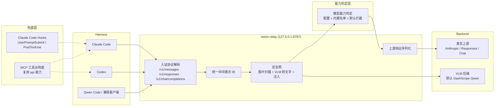

# vision-relay 代理安全网设计 — 第一阶段（Phase 1）

> 日期：2026-08-13
> 修订：2026-08-16 —— 吸收 DSH 视觉插件生态调研启示；同日拆分：**本文件 = 第一阶段（Claude Code + Codex + Qwen Code）**；第二阶段另行设计
> 状态：已实现（Phase 1 完成并验收，见 plans/2026-08-16-vision-relay-phase1-acceptance.md）
> 目标仓库：jarvislee90s-dot/vision-relay（独立仓库；本设计稿原撰写于 Qwen-MM-Plugins fork，2026-08-19 移植适配）
> 范围：为纯文本模型提供一层协议代理安全网，解决“纯文本模型接收图片导致报错”和“工具/用户图片漏进上下文”的问题。

## 1. 背景与目标

Qwen-MM-Plugins 目前以 Skill + MCP server 形式为 Claude Code、Codex、Qoder、OpenClaw、Qwen Code、Gemini CLI 等 harness 提供多模态能力。但 Skill/MCP 属于“工具调用层”，存在天然盲区：

- 用户消息里直接粘贴的图片，由 harness 组装进请求，Skill/MCP 工具层看不到、拦不住。
- 工具调用返回的图片块（例如 `read_image`、截图类工具）会被 harness 原样放进上下文；如果主模型是纯文本模型，请求会报错或图片被静默丢弃。
- 模型对“何时调用哪个工具”是隐性决策，工具越多准确率越难保证。

社区现状（2026-08 调查，2026-08-16 补充 DSH 生态）：没有主流 harness 内置“为纯文本模型做图片中转”的能力。现有方案分四派：

- 代理派（Codex++ PR #1550）：在模型与 harness 之间拦截请求，抽图转文字后替换，最无感，但当前实现绑定 CodexApp，且 Responses 协议下直连上游。
- Hook 派（CC-Vision、cc-vision-hook 等）：用 `UserPromptSubmit` / `PostToolUse` 把粘贴图和工具图转文字后 `additionalContext` 注入，但只能追加、不能删除原图，对“协议级硬拒绝图片”的模型无效。
- MCP 工具派（vision-bridge-mcp 等）：提供图片转文字的 MCP 工具，靠模型主动调用，不拦截。
- 进程内适配器派（DSH 生态，新增主流）：在 harness 的 LLM adapter seam 上注册新 provider 路由，`stream()` 里扫描图片块 → VLM 转文字 → 替换 → 透传内层适配器（如 `dsh-vision-recognizer`、`dsh-deepseek-vision`、`dsh-llm-vision-bridge`、`dsh-vision-proxy` 等 10+ 个插件）。这是“代理派”在 harness 进程内的原生落法：免协议归一化、与 relay 天然共存，但绑定具体 harness。

> **DSH 修订 · 新设计输入**：DSH 存在“附件准入”闸门——按模型 `inputModalities` 在图片进入会话前就拒绝（`MODEL_DOES_NOT_SUPPORT_IMAGES`），插件须先“声明图片输入”图片才能进请求。这是 Claude Code / Codex / Qwen Code 都没有的一层，对“代理派”意味着**只改 base_url 可能拦不到图**，需在能力判定层预留准入声明（第二阶段实现）。

本设计的目标：**提供独立协议代理服务 vision-relay，以协议代理为主，在纯文本模型场景下统一拦截所有图片内容，并兼容多协议互转。**

## 2. 范围与第一版边界

第一版包含：

- **目标 harness（Phase 1）**：Claude Code（Anthropic）+ Codex（OpenAI）+ Qwen Code（OpenAI Chat / DashScope 兼容）三个一等 harness（本仓库是千问插件，Qwen Code 优先一等）；OpenCode 与 DSH 支持均留第二阶段。
- 本地常驻 HTTP 代理，单端口支持三种入站协议：Anthropic Messages、OpenAI Responses、OpenAI Chat。
- 协议归一化层：**9 种组合（入站 3 × 上游 3）的请求转换全部实现，含 Responses 上游序列化**（Phase 1：三格式全量保留，不瘦身）；流式转换第一版支持“入站=上游”直通，以及 Anthropic ↔ Chat 两种常见跨协议转换，其余跨协议流式（Responses ↔ 其他）留第二阶段。
- 图片处理管线：每次请求全量扫描、VLM 转文字、两层缓存、上下文预算、fail-open。
- 模型能力判定：用户配置优先，内置供应商默认名单兜底，未知模型默认拦截。
- MCP 复用现有 api 能力（工具派，非 proxy 新增交付）。
- 生命周期管理：`vision-relay start/stop/status/logs/test-image/check`、三 harness base_url 改写与回滚。

第一版不包含（第二阶段实现）：

- OpenCode 一等接入（Phase 1 · 第二阶段）：OpenCode 是配置文件型 harness（`opencode.json` 自定义 provider，入站 OpenAI Chat）；本阶段只做 Qwen Code，OpenCode 统一放第二阶段。
- DSH 兼容（Phase 1 · 第二阶段）：DSH 无 base_url 概念，以 provider 路由/适配器形态接入；准入声明（§6.6）第二阶段实现。
- Claude Code 侧 hooks（UserPromptSubmit / PostToolUse）兜底（第二阶段）：代理是第一跳、100% 覆盖 CC 流量，hooks 属冗余兜底，实现与 `enable_hooks` 开关留第二阶段。
- Web UI 控制面板（第二阶段）：控制面第一版只提供 CLI 与 JSON 管理 API 接口预留（`ui_port` 保留），内置 Web UI 留第二阶段。
- 磁盘缓存与 Phase 2 后台深缓存（第二阶段）：第一版只用内存缓存（§5.5），`cache_disk` 与黄金窗口外后台写缓存留第二阶段。
- 跨协议流式（Responses ↔ 其他）（第二阶段）：第一版流式限定同协议直通 + Anthropic ↔ Chat。
- TRAE、Kimi Code 等 harness 的 hooks 接入（第二阶段）。
- relay 多供应商轮转（Codex++ 的 Aggregate 能力不属于本安全网目标）。
- 服务端部署（只做本地 127.0.0.1 代理）。
- 商业级进程守护（不引入 supervisor；macOS launchd 仅文档说明，用户可选项）。

## 3. 架构总览



核心原则：

- **base_url 一律指向本地代理**，无论什么协议，这是与 Codex++ 的关键差异（其 Responses 协议直连上游）。
- **安全网只做在 IR 层**，三协议只写一份图片处理逻辑。
- **vision 模型零开销直通**，不进入安全网。
- **任何失败都 fail-open**：安全网自身挂了也不能比没有安全网更糟。
- **上下文隔离是代理派的天然优势**（DSH 修订）：图片在 IR 层就被替换成文字，图片字节从不进入主模型上下文。DSH 子代理派用“隔离上下文”实现同一目标，代理派零额外成本获得，宣传与文档中应强调这一点。
- **对外契约（Phase 1 · model-facing contract）**：对每个 harness，代理呈现为一个**稳定的文本模型端点**（base_url + 模型名透传，图片照发，harness 感知不到安全网）；对上游，代理是协议客户端（收到的请求里图已被文字替换）；对 VLM，代理是批处理消费者（Tier1/Tier2 + 缓存 + 预算）。核心目标 = **把视觉能力“配置”给文本模型**：文本模型在 harness 里表现得像能看图。

## 4. 协议归一化层

### 4.1 入站协议识别

按请求路径与请求体结构识别协议，不按 harness 猜测：

- `/v1/messages` → Anthropic Messages
- `/v1/responses` → OpenAI Responses
- `/v1/chat/completions` → OpenAI Chat

解析失败返回明确的协议错误，不静默放行。

单端口同时服务 Claude Code / Codex / Qwen Code 的并发会话（Phase 1）：协议按**每个请求**独立识别，代理不维护 harness/会话级共享可变状态；VLM 批量限流为全局信号量（§5.4），请求间失败相互隔离（fail-open，§9）。

### 4.2 统一中间表示（IR）

IR 定义：

- `model`：模型名。
- `messages`：`role`（user/assistant/tool）+ 内容块列表，内容块类型统一为 `text` / `image` / `tool_use` / `tool_result`。
- `system`：系统提示（Anthropic 在顶层，OpenAI 在 messages[0]）。
- `tools`：工具定义。
- `stream`、`max_tokens`、`temperature`、`reasoning` 等参数。

各协议图片块归一化规则：

| 协议 | 图片输入 | IR 表示 |
|---|---|---|
| OpenAI Chat | `content[].image_url`（url 或 data URL） | `image { url }` |
| OpenAI Responses | `input[].input_image` 或 tool 输出 data URL | `image { url }` |
| Anthropic | `content[].source`（base64 + media_type） | `image { base64, media_type }` |

#### 4.2.1 tool_result / 工具输出里的图片

工具结果里的图片分两种形态，IR 必须都归一化成 `image` 块并进入同一套管线：

1. **结构化图片块**：Anthropic 的 `tool_result.content` 可含 `{type:"image", source:{...}}`；OpenAI Responses 的 `function_call_output.output` 可含 `input_image` 块；Chat 的 tool 消息 `content` 可含 `image_url` 块。
2. **字符串内嵌 base64 data URL**：工具输出被序列化为字符串时（`function_call_output.output` 为字符串、Chat tool 消息 `content` 为字符串），`data:image/...;base64,...` 藏在文本里。这是最常见的漏网形态（Codex++ issue #1701：一张 639KB 图 → 66 万 token）。

**base64 data URL 本质是纯文本**：纯文本模型不会对它报错，而是把它当乱码字符逐 token 读取、撑爆上下文。所以它不是「会不会被模型读到」的问题，而是「必须主动从字符串里抽出来」的问题。图片抽取层（§5.3）因此必须同时处理结构化块与字符串内嵌两种形态，用 `extract_data_urls` 等价逻辑扫描 `data:image/{subtype};base64,{payload}`（payload 由 `[A-Za-z0-9+/=]` 组成）。

**修订 · 实现（Phase 1）**：`_text_with_images` 在 IR 解析时即把字符串内嵌 data URL **提前剥离**——text block 中替换为 `[图片]` 短占位，base64 只进 `image` 块，文本层永不出现 base64、不占上下文预算（省 token）；**普通网址（https/http）、文件路径、非 image data URL 不匹配、原样保留，不被误剥**。assistant 消息的图片块同样纳入图片抽取（`pipeline._collect_images` 覆盖 `user / tool / assistant`，防御模型主动调工具返回图）。

### 4.3 转换矩阵

请求转换：入站 3 × 上游 3 全部支持。相同协议直接透传结构；不同协议按 IR 重建。

流式转换：第一版支持

- 入站=上游：原样透传 SSE。
- Anthropic ↔ Chat：逐事件翻译（`content_block_delta` ↔ `choices[].delta`）。
- 其余跨协议流式：第二版。

### 4.4 与中继工具共存

cc-switch / Codex++ 等中继本质都是**改写 harness 的 base_url**：直连 = 指向真实上游；路由 = 指向自己的 relay 端口再转发。它们都能做协议互转（Anthropic ↔ Chat/Responses）。

本代理与它们共存的铁律：**本代理必须是第一跳**，即 harness 的 base_url 指向本代理（`127.0.0.1:8787`），链路为：

```
harness → 本代理(8787) → [可选] cc-switch / codex++ → 真实上游
```

只要 harness 的 base_url 指向本代理，100% 流量先过本代理，后面接谁都能拦到。冲突点在于：多个工具都抢同一个 base_url，谁后运行谁生效，本代理可能被绕过。因此：

- **幂等剥图**：剥图以图片内容哈希为幂等键。若本代理已把图替换成 `[图片描述]`，下游 codex++ 再剥图时看不到图片块，天然无副作用。
- **单一图片路由代理原则**：链路里只开一个「路由+剥图」代理，其余中继关掉图片处理。若两个代理同时对同一张图各调一次 VLM，会产生双倍延迟与费用（竞态），故 `check` 需检测并告警（§8.3）。
- **入站侧协议归一化不依赖具体中继**：只要入站是三种协议之一即可，不管它是 cc-switch 转来的还是 codex++ 转来的。

**拓扑形态 A/B 对比（本代理放第一层 vs 第二层）**

- **A. 第一层（默认/首推）**：`harness -> 本代理(8787) -> 工具(15721/57321) -> 真实上游`
  - 优点：图 100% 先被本代理截到（核心功能从机制上保证）；最先做 IR 归一化、入站协议最可控；彻底绕开「工具是否透传图片」的不确定。
  - 代价：需让 harness 一次性指向 8787（install.sh proxy_rewrite_* 或手动）；工具从「harness 直属网关」降级为本代理的下游，链路多一层。
- **B. 第二层（可选，非首选）**：`harness -> 工具(15721/57321) -> 本代理(8787) -> 真实上游`
  - 优点：完全不用改 harness 配置（工具自身路由把 harness 指向工具，我们只把工具 upstream 指向 8787，属工具配置而非 harness 配置）；工具保持自然网关位、可继续做模型路由/角色映射。
  - 致命依赖（不满足则视觉静默失效）：工具有没有把**原始图片载荷原样透传**给上游（本代理）；以及工具上游变成 8787 而非真实模型 URL 时，工具（尤其 Codex++ 的 chat<->responses、CC Switch 的模型读取）可能「读不到模型/格式不对」。
  - 结论：B 可支持但需先验证目标工具会透传图片、且本代理能装得像个标准模型端点；文档须标注失败模式。

## 5. 图片处理管线

### 5.1 扫描范围与两阶段

每次请求对 IR 全部 user/tool 消息扫描，深度与黄金窗口沿用 Codex++ 常量（`vision.rs`）：

- `ANALYZE_DEPTH_LIMIT = 50`：最多回溯最近 50 条 user/tool 消息。
- `GOLDEN_WINDOW_DEPTH = 10`：最近 10 条 user/tool 消息为「黄金窗口」。

分**两阶段**处理：

- **Phase 1 同步**（阻塞请求，Phase 1 实现）：当前轮不限量 + 黄金窗口内历史（受 X 预算封顶，§5.7）→ 同步调 VLM 并注入描述。
- **Phase 2 后台**（`asyncio`/线程后台，**第二阶段实现**）：仅当 `X > 10` 时，收集黄金窗口外、分析深度内、未缓存的深层图，异步调 VLM **只写缓存、不注入当前消息**；失败静默，缓存保持未命中待后续请求重试。

不只看本轮的原因：

- 当前轮是纯文本追问但历史有图时，需要注入历史图描述（§5.8）。
- 代理启用前已经进过上下文的图片需要兜底。
- 上下文预算需要基于全量计算（§5.7）。

### 5.2 能力判定接入

先查模型能力表：

- `vision`：整个请求直通，不进管线。
- `text_only`：进入管线。
- 未知：默认拦截（用户已确认，走一次 VLM）。

### 5.3 图片抽取

从 IR 抽取图片，用户消息与 tool_result 均覆盖，且**两种形态都处理**：

- 结构化图片块：`image { url / base64 }`。
- 字符串内嵌 base64 data URL：用 `extract_data_urls` 等价逻辑扫描文本中的 `data:image/{subtype};base64,{payload}`，逐段抽出（payload 由 `[A-Za-z0-9+/=]` 组成）。

多图按 `[[图片K]]` 顺序标记。

Phase 1 形态边界：只处理协议内结构化图片块与字符串内嵌 data URL（如上）；**不解析“文件路径形式”的图片**（如工具存盘返回路径、`/tmp/xxx.png` 这类工具输出）。路径图不属于协议内图片通道，交由 MCP 工具派 / Skill 兜底（§7.2），避免 Phase 1 在文件系统探测上膨胀（路径图在 OpenCode 接入时是否纳入，第二阶段再定）。

### 5.4 VLM 调用

- 当前轮：有用户文字问题时用 Tier2（`URL+问题` 缓存键 + 聚焦 prompt）；无问题退回 Tier1（全面描述）。
- 历史轮：只用 Tier1。
- 批量：`BATCH_SIZE=5`，单批失败隔离、各自重试；`BATCH_MAX_ATTEMPTS=2`（每批共 3 次尝试），指数退避 `3·2^(n-1)` 加抖动。**（Phase 1 已实现：VLM 失败重试 3 次 + 指数退避 + 抖动——`pipeline._describe_with_retry` / `vlm._is_retryable`；AUTH/PARSE 不重试。BATCH_SIZE 分批并行留 Phase 2。）**
- 后端：默认 DashScope Qwen（`qwen3.5-omni-plus` / `qwen-vl-max`），可配任意 OpenAI-compatible 或 Anthropic 端点。
- **格式独立于主模型**：VLM 后端单独配 `format ∈ {anthropic, responses, chat}`（默认 `chat`）。主模型与 VLM 常非同一厂商、协议不同，故默认不自动跟随主 relay；枚举与主入口一致，可选 `auto` 跟随匹配到的主 relay 协议（仅同厂商时方便）。
- **VLM 端协议面收敛为 OpenAI 兼容为主、Anthropic 原生可选**（DSH 修订，参考 `dsh-vision-recognizer`）：VLM 端点绝大多数是 OpenAI 兼容，第一版只实现 `/chat/completions`（chat）作为完整路径，`format=anthropic` 只做原生 Messages 直发，`responses` 留二版——降低 VLM 端协议实现面，把精力留给主链路协议归一化。
- **结构化证据 prompt**（DSH 修订，参考 ModLens / `dsh-tool-vision`）：Tier1/Tier2 prompt 让 VLM 输出固定结构——逐字 OCR + 布局要点 + 关键元素 + 显式 `uncertainty`（无法确定项）。纯文本追问时主模型能区分“已读到的”与“不确定的”，与 §5.8 追问检测互补；受 §5.7 上下文预算约束（描述变长会增加注入 token），`AVG_DESC_BUDGET` 需实测调参。

### 5.5 缓存

两层，**内存为主 + 可选磁盘**，按图片内容哈希。结构与 Codex++ 一致：

- Tier1：`URL → 描述`（历史轮/无问题当前轮）。
- Tier2：`(URL, 问题) → 描述`（有问题的当前轮）。

关键实现（抄 `vision.rs`）：

- **结构化缓存键**：用 `(URL)` / `(URL, 问题)` 完整结构做键（HashMap 的 Eq 比较原始字符串），**不用 hash 值**，彻底消除 64 位哈希碰撞导致的「张冠李戴」。
- **内存层**：容量 `CACHE_CAPACITY=500`，TTL `24h`，满时按写入时间踢最旧（LRU）；缓存命中零 VLM 调用。
- **磁盘层（可选，默认关）**：`cache_disk=true` 时按内容哈希落盘 + TTL，重启后命中，跨会话省 VLM 费用。MVP 默认内存，磁盘留二版或开关开启。

### 5.6 注入与 fail-open

- 正常：在带图消息文本末尾追加 `[图片描述] {desc}`，多图用 `[[图片K]]` 前缀。
- fail-open / strip / 溢出：向最近 user 消息注入“看不到图”系统提示，文案风格按 Qwen 库（说明原因 + 操作建议 + 禁止编造）。
- 剥离模式：图片替换为 `[图片已省略]`。

### 5.7 上下文预算

- 先剥图估算纯文本 token（`bytes/2` 粗估，主流 tokenizer 压缩比约 1.5–2 bytes/token，取保守），留 10% 安全余量（`CONTEXT_SAFETY_MARGIN=0.9`）。
- `available = context_window × 0.9 − 纯文本估算`；`X = available / AVG_DESC_BUDGET`（`AVG_DESC_BUDGET=100` token ≈ 200 字）决定可注入描述数量。
- 当前轮不限量；黄金窗口受 X 封顶；预算不足优先最近消息；深层历史只注入缓存命中项，未命中的交给 Phase 2 后台。
- `available ≤ 1` 视为上下文已满：剥离全部图片 + 注入「上下文已满」提示，返回。
- **字符串 data URL 不计入纯文本预算**：`_text_with_images` 在 IR 解析时即把字符串内嵌 data URL 替换为 `[图片]` 占位（base64 只进 image 块），预算估算前文本已不含 base64（`_text_without_data_urls` 兜底防御）；否则 T3/T4 的大体积工具返回图会被 `bytes/2` 算爆预算 → 误判 `CONTEXT_FULL` 剥图、不调 VLM。

### 5.8 追问检测

当前轮为纯文本、窗口内历史有图时，注入“描述未覆盖细节请重发图+问题，禁止编造”的提示。

**已实现（Phase 1）**：`pipeline._maybe_inject_followup` 在图片处理后注入（历史图数与当前轮“原本是否有图”在处理前统计传入，避免处理后图块被替换无法判断），文案对齐 Codex++ `inject_followup_note`。

## 6. 模型能力判定与 relay 配置

配置存放：`~/.vision-relay/proxy.json`（0600 权限），由 `vision-relay start` 交互引导与 `models` 命令读写。

### 6.1 判定优先级

1. 用户显式配置覆盖表。
2. 内置供应商默认名单。
3. 未知模型 → 默认拦截。

### 6.2 匹配规则

支持精确模型名、供应商前缀、通配符，按顺序匹配、命中即止。

内置默认名单（第一版）：

```toml
[model_capabilities]
"deepseek/*"            = "text_only"
"glm/*"                 = "text_only"
"zai/*"                 = "text_only"
"openai/*"              = "vision"
"anthropic/*"           = "vision"
"google/*"              = "vision"
"qwen-vl-*"             = "vision"
"qwen3.5-omni-*"        = "vision"
"kimi-k2.7-code*"       = "vision"
"openrouter/deepseek/*" = "text_only"   # Phase 1：Codex/Qwen Code 常走 OpenRouter 前缀，防误判为 vision
```

用户可新增例如 `"deepseek-vl-*" = "vision"`、`"openrouter/qwen/*" = "vision"`。

### 6.3 relay 配置

```json
{
  "server": { "bind_host": "127.0.0.1", "bind_port": 8787, "ui_port": 8788 },
  "relays": [
    { "name": "deepseek-official", "protocol": "responses",
      "base_url": "https://api.deepseek.com", "api_key": "…",
      "models": ["deepseek/*"], "capability": "text_only" },
    { "name": "claude-official", "protocol": "anthropic",
      "base_url": "https://api.anthropic.com", "api_key": "…", "models": ["anthropic/*"] }
  ],
  "vlm": {
    "model": "qwen-vl-max",
    "base_url": "https://dashscope.aliyuncs.com/compatible-mode/v1",
    "api_key": "…",
    "format": "chat",
    "cache_disk": false,
    "auto_local_ollama": true
  }
}
```

按请求 model + 入站协议匹配 relay；匹配不到用默认 relay。第一版不做轮转。VLM 后端与主 relay 解耦，可指向不同厂商、不同协议。

**修订 · relay 协议强校验**：`protocol` 必填且只能是 `anthropic | responses | chat` 之一；配置非法（缺失 / 枚举外 / 类型错误）时 `check` 显式报错（`config error: relay ... protocol must be one of ...`），不再静默回退默认配置（实现：`config.py` 的 `PROTOCOLS` / `ConfigError` / `_parse_relays` / `load_config`）。

**修订 · base_url 拼接规则（对齐 Codex++ build_versioned_url）**：relay 的 `base_url` 语义是「上游 API 的完整根地址」。目标路径：anthropic → `/messages`、responses → `/responses`、chat → `/chat/completions`。**anthropic 协议固定补 /v1**（Anthropic 端点规范为 `/v1/messages`，无论 base 是否带版本段，配合 `/v1/v1` 去重）——用户填直连根即可（如 `.../api/coding` → `.../api/coding/v1/messages`）；chat / responses 用 Codex++ build_versioned_url 启发式。规则（base_url → 目标 URL）：

1. base 已以 path 结尾 → 原样返回；
2. base 以 `#` 结尾 → 跳过版本段，直接 base + path；
3. base 最后段形如 `v<数字>`（v1 / v3 / v1beta）→ 直接 base + path；
4. base 非纯 origin（scheme://host 之后还有路径）→ 直接 base + path；
5. base 纯 origin（scheme://host，无路径）→ base + /v1 + path；
6. 最后 `/v1/v1` 去重。

例：`https://api.deepseek.com`（chat）→ `/v1/chat/completions`；`https://ark.cn-beijing.volces.com/api/coding/v3`（chat / responses）→ `/v3/chat/completions`、`/v3/responses`；anthropic 填直连根 `https://ark.cn-beijing.volces.com/api/coding` → 自动拼 `/api/coding/v1/messages`（无需手动加 /v1）。实现：`server.py` 的 `_upstream_url`。

**修订 · relay `via` 字段与单/双层显式表达**：拓扑由 relay 的 `base_url` 唯一决定——远端地址 = 一层直连；回环工具地址（15721 / 57321）= 两层经工具。可选、纯描述性字段 `via`（∈ cc-switch | codex-plus，默认省略=一层），**不参与 URL 拼接**，只用于 `check` 输出每条 relay 的拓扑（一层直连 / 两层经工具）与校验（via 与 base_url 端口不一致时告警，如 via=codex-plus 但端口不是 57321）。老配置（无 via）完全兼容（实现：config.py 的 VIA_TOOLS / RelayConfig.via，cli.py 的 cmd_check）。

- 一层（直连）模板：`{ "name":"deepseek", "protocol":"chat", "base_url":"https://api.deepseek.com", "models":["deepseek-*"] }`
- 两层（经 Codex++）模板：`{ "name":"codex", "protocol":"responses", "base_url":"http://127.0.0.1:57321/v1", "via":"codex-plus", "models":["*"] }`
- 两层（经 CC Switch，Codex 模型）模板：`{ "name":"cc-codex", "protocol":"chat", "base_url":"http://127.0.0.1:15721", "via":"cc-switch", "models":["*"] }`
- 两层（经 CC Switch，Claude 模型）模板：`{ "name":"cc-claude", "protocol":"anthropic", "base_url":"http://127.0.0.1:15721", "via":"cc-switch", "models":["*"] }`
- Qwen Code 不在 CC Switch 支持列表（claude/codex/gemini），给它单独一条 relay 直连真实端点：`{ "name":"qwen-direct", "protocol":"chat", "base_url":"<Qwen Code 直连端点>", "models":["*"] }`
- **抗干扰（显式配置的收益）**：机制完全由配置决定、从不探测/指纹端口，VPN 或其他本地代理插在链路中间不会造成误判；唯一涉及系统代理处是远端上游转发时的 `_is_loopback -> trust_env=False`（回环工具跳不套 VPN/系统代理）。若未来要加自动检测，需记录其失败模式（端口探测易与 VPN/本地服务端口撞、工具无法可靠指纹、可能误判 A/B 放法），做成 opt-in + 严格指纹 + 绝不改写 harness 配置；当前不实现。

**DSH 修订 · 免费/本地 VLM 通道**（启示 6，参考 `dsh-vision-recognizer` / `dsh-vision-proxy` 的 `autoLocalOllama`）：`auto_local_ollama=true` 时，启动探测本地 Ollama，命中则把本地视觉模型插到 VLM fallback 链最前——无 key 用户零配置即可识图、图片不出本机；未命中或无本地模型时静默跳过，回退到配置的云端端点。

**上游同步 修订 · VLM 配置 env 覆盖惯例（对齐上游 `resolve_vl_model()`）**：上游 2026-08 确立「config 而非 source edit」惯例——`resolve_vl_model()`/`resolve_omni_model()` 在**调用时**读 `QWEN_MM_API_VL_MODEL` / `QWEN_MM_API_OMNI_MODEL`，env 优先、默认常量兜底，并统一走 `vision_relay.env_util.get_env`。proxy 的 `[vlm]` 对齐同一惯例：

- 支持 `VISION_RELAY_VLM_MODEL` / `VISION_RELAY_VLM_BASE_URL` / `VISION_RELAY_VLM_API_KEY` / `VISION_RELAY_VLM_FORMAT` 环境变量，优先级：**显式配置 > env > 内置默认**。
- 一律经 `vision_relay.env_util.get_env` 读取（env > 配置文件 > 默认）；旧 `QWEN_MM_PROXY_*` 环境变量名仍可读取（打印一次性 deprecation 提示）。
- 换 VLM 供应商/模型从「改配置」降为「改环境变量」，与上游 api 能力体验一致。

### 6.4 判定结果缓存

进程内缓存 `模型名 → 能力`，避免每个请求重复做规则匹配。

### 6.5 密钥安全

api_key 只存本地配置（600 权限）；客户端只发识别 relay 用的标记，真实上游 key 不下发到 harness；日志不写明文 key。

### 6.6 准入声明（第二阶段实现）

针对带 `inputModalities` 类“附件准入”闸门的客户端（典型：DSH）：这类客户端在图片进入会话前按模型声明拒绝（`MODEL_DOES_NOT_SUPPORT_IMAGES`），**纯改 base_url 拦不到图——图片根本进不了请求**。本阶段三 harness（Claude Code / Codex / Qwen Code）均无此闸门，准入声明的完整设计（`admission_declare` 字段、声明机制、判定结果缓存、安全语义）留待第二阶段实现。

## 7. 兜底通道（上游生态）

> 独立化说明（2026-08-19）：原稿此章描述「MCP 工具派兜底（复用上游 Qwen-MM-Plugins 的 api capability）」。独立仓库不携带 api capability，该机制保留在上游生态；本仓库的兜底即 fail-open（§9）与 `test-image` 手动诊断。路径形式图片（§5.3 边界）的兜底同样交由上游/用户侧 MCP 工具处理。

## 8. 生命周期与 harness 接入

### 8.1 capability 形态

独立 Python 包 `vision_relay`（PyPI: `vision-relay`），MCP 无关（常驻 HTTP server），命令行入口 `vision-relay`，配置与日志在 `~/.vision-relay/`。

**组件形态**：proxy 是常驻 HTTP server，分**数据面 / 控制面**两个端口：

- **数据面（`127.0.0.1:8787`，`bind_port`）**：服务三种入站协议（`/v1/messages`·`/v1/responses`·`/v1/chat/completions`），这是与 harness 的稳定契约（base_url 指向它），不随 UI 变化。
- **控制面（`127.0.0.1:8788`，`ui_port`）**：暴露一份 **JSON 管理 API**（路由开关、路由态、status、Tier1/Tier2 测试），第一版由 CLI（§8.3）消费；内置本地 Web UI（自包含 HTML/JS，直接消费这份 API）留第二阶段。harness 完全感知不到控制面。

分离的好处：数据面保持稳定，UI 只是管理 API 的消费者。后期要换独立前端（Rust/Tauri 或任何形态），只要让它去请求 8788 的同一套 JSON 接口即可，数据面 8787 一个字不改。不引入 Rust/Tauri——本仓库是 Python 仓库，用 Rust 会额外引入一套构建与分发链；proxy 本就是 HTTP server，控制面直接骑在它上面即可。

### 8.2 安装与接线（独立库形态）

`pip install vision-relay` 后，`vision-relay start` 完成一切接线：

- 读取 `~/.vision-relay/proxy.json`（0600；首次运行交互引导生成）；`bind_host`/`bind_port` 可配（默认 `127.0.0.1:8787`），`check` 检测端口占用。
- `start` 自动改写三处 harness base_url 指向本代理（改写前备份，`stop` 自动还原；`check` 检测冲突并给链路顺序建议）：
  - Claude Code：`~/.claude/settings.json` 的 `env.ANTHROPIC_BASE_URL`。
  - Codex：`~/.codex/config.toml` 的 `base_url`。
  - Qwen Code：`~/.qwen/settings.json` 的 `model.baseUrl`。
- 旧版 `~/.qwen-mm-plugins/proxy.json` 会被自动读取并迁移（读旧写新，见 rebrand spec §5.3）。

### 8.3 运行命令

- `vision-relay start`：启动常驻服务（默认绑定 `127.0.0.1:8787`，PID 文件 + 单实例锁）。
- `stop` / `status` / `logs`：停止、健康检查、查看结构化日志。
- `test-image <path> [--question <q>]`：验证 VLM 后端连通与描述质量；无 `--question` 走 Tier1 全面描述，带 `--question` 走 Tier2 聚焦描述，两条结果并排返回，直接对比。
- `check`：`--check-system` 依赖自检（端口占用、VLM key、relay 配置）+ **路由态识别**：读 harness 当前 base_url 归属、探测 cc-switch / codex++ 监听端口与运行进程、检测「双重剥图」竞态，冲突时告警并给顺序建议。
- **生命周期命令惰性加载配置（修订）**：`start` / `check` / `test-image` 才加载 `proxy.json`，relay 配置非法时打印 `config error: ...`（带 `relays[i] (name)` 定位）并 exit 2；`stop` / `status` / `logs` **不加载配置**（只读 PID / 日志），损坏的 `proxy.json` 不会锁死这几个生命周期命令（相对旧「静默回退默认配置」的操作修正）。

### 8.4 日志与观测

日志写到 `~/.vision-relay/logs/proxy.log`，JSON 行，包含 `vl_call`（status/duration_ms/error）、`vl_strip`（reason/n）、`vlm_cache_hit` 等埋点，复用 Codex++ 的诊断日志思路。

## 9. 错误处理与容错

铁律（抄 Codex++ 差异 1）：**任何失败都 fail-open** —— 图片被剥离 + 注入「看不到图」系统提示（说明原因 + 当前模式 + 修正建议 + 禁止编造），请求继续转发，**绝不比没有安全网更糟**。VLM 配置缺失时按 Strip 降级（绝不把 base64 透传给纯文本模型）。

### 表 A：三态 × 失败场景行为矩阵

| 场景 \ 模式 | send-as-is（vision 模型） | strip（纯文本·未配 VLM） | vlm（纯文本·已配 VLM） |
|---|---|---|---|
| VLM 成功 | 不进入管线，图片原样直通 | —（不调 VLM） | 图片 → 描述替换，注入 `[图片描述]` |
| VLM 调用失败 / 超时 | — | — | 剥离图片 + 注入「视觉模型调用失败」，历史缓存命中项仍注入 |
| 上下文溢出（available≤1） | 直通（vision 模型不走管线） | 剥离图片 + 注入「上下文已满」 | 剥离图片 + 注入「上下文已满」 |
| VLM 配置缺失 | — | 剥离图片 + 注入「图片已省略」 | 降级为 Strip：剥离 + 注入「图片已省略」 |
| 协议解析失败 | 返回明确协议错误，不静默放行 | 同左 | 同左 |
| 上游连接失败 | 原样透传上游错误 | 同左 | 同左 |
| 代理自身异常 | fail-open：不阻断请求 | 同左 | 同左 |
| 并发 | 请求并发；VLM 批量限流（信号量 5）防打爆 | 同左 | 同左 |

### 表 B：fail-open 注入与埋点矩阵

| 失败场景 | 剥离动作 | 注入提示 | 埋点（`vl_strip` reason） | 请求是否继续 |
|---|---|---|---|---|
| VLM 超时 / send_error | 剥离当前轮图片 | 「看不到图」+ 原因 + 换多模态模型 / 配 VLM 建议 + 禁止编造 | `vl_failed` | 继续（fail-open）|
| VLM http_error（非 2xx） | 同上 | 同上 | `vl_failed` | 继续 |
| VLM json_error / parse_error | 同上 | 同上 | `vl_failed` | 继续 |
| 上下文溢出 | 剥离全部图片 | 「上下文已满，图片未处理」 | `overflow` | 继续（返回前注入）|
| 缓存 miss + VLM 不可用 | 剥离图片 | 「看不到图」提示；历史缓存命中项仍注入 | `vl_failed` | 继续 |
| VLM 配置缺失 | Strip 降级（不透传 base64） | 「图片已省略」 | `strip` | 继续 |
| 批解析失败（多图） | 该批剥离 | 「视觉模型调用失败」 | `vl_failed` | 继续 |
| 深层 Phase 2 失败 | 无（只写缓存不注入） | 无 | `vlm_phase2_error` | 继续（缓存保持未命中）|

> 对应 Codex++ 差异 4：剥图后必须注入状态提示，把「界面无标识 / 配置误操作 / 纯文本模型已识图」的误解显式暴露在对话里，防模型编造。

## 10. 测试与发布

### 10.1 单元测试

- 协议解析/序列化：9 种组合请求转换。
- IR 归一化：三种协议图片块 ↔ IR ↔ 输出。
- 能力判定：精确/前缀/通配/覆盖/未知默认拦截。
- 图片管线：扫描（用户消息 + tool_result + data URL）、Tier1/Tier2、BATCH_SIZE 分批、缓存键、fail-open、注入格式、上下文预算、追问检测。

### 10.2 集成测试

- mock 上游（Anthropic/Responses/Chat）+ 真实代理，三种入站协议请求，断言上游收到无图片块、含描述。
- 流式：同协议直通、Anthropic ↔ Chat 跨协议转换。
- hooks：提取器对三种 tool_response 结构。

### 10.3 回归

- 回归基线：`python3 -m pytest -q`、`ruff format --check .`、`ruff check .`。（上游的 check_manifests.py 与 bash -n 随独立化移除）

### 10.4 发布

- 版本：`vision_relay.__version__`（pyproject dynamic version），SemVer。
- 发布：打 `v*` tag → CI 构建 sdist/wheel 并创建 GitHub Release；PyPI 用 trusted publishing（OIDC，零 token）。
- `CHANGELOG.md`（Keep a Changelog 格式）随每次发布更新。

### 10.5 Phase 1 端到端验收清单（真实 harness 跑通）

Phase 1 完成的硬性判定，逐项在真实环境验证：

1. **Claude Code**：贴一张图（含报错截图）→ 收到注入 `[图片描述]` 后的文本模型回答，会话不报错。
2. **Codex**：同上（Responses 入站）；`read_image` / 截图类工具返回的图被剥成文字，上下文不出现 base64。
3. **Qwen Code**：同上（OpenAI Chat 入站，`DASHSCOPE_BASE_URL` 指向代理）。
4. **工具返回图**：CC 的 `Read`/`read_image`、Codex 截图工具返回的结构化图片块与字符串内嵌 data URL 均被处理（§4.2.1 / §5.3）。
5. **fail-open**：拔掉 VLM key / 断网后，贴图仍能对话（图片被剥离 + 「看不到图」提示注入），绝不 400 死锁。
6. **流式**：三 harness 的回答正常流式返回（同协议直通 + Anthropic ↔ Chat）。
7. **能力判定**：vision 模型（如 qwen-vl）直通不剥图；未知模型默认拦截走一次 VLM。
8. **生命周期**：`start/stop/status/logs/test-image/check` 可用；`uninstall` 恢复三 harness 原 base_url 配置。

## 11. 与 Codex++ 的对比与优化

| 维度 | Codex++ PR #1550 | 本设计（Qwen-MM-Plugins proxy） |
|---|---|---|
| 覆盖 harness | 仅 CodexApp | Claude Code + Codex + Qwen Code（Phase 1 一等），后续可扩展 OpenCode / TRAE/Kimi、DSH |
| 协议 | 仅 OpenAI（Responses/Chat），且 Responses 直连上游 | 三协议归一化，入站 3 × 上游 3，base_url 一律指向代理 |
| 图片安全网位置 | messages 数组层 | IR 层，三协议共用一份处理逻辑 |
| 工具/用户图片 | 代理层处理 tool data URL | 代理 + hooks + MCP 工具三层 |
| 模型能力判定 | per-model checkbox | 配置优先 + 内置供应商名单 + 未知默认拦截 |
| 注入格式 | 消息内追加 `[图片描述]` / fail-open 提示 | 同 Codex++ 位置，文案风格按 Qwen 库 |
| 缓存/预算 | 两层缓存 + golden window + X budget | 复用相同思路，内存 + 可选磁盘，加 TTL |
| 生命周期 | 内嵌于 Codex++ | 独立 PyPI 包 + CLI + 备份回滚 |
| 管理界面 | Tauri 桌面应用（Rust） | 内置本地 Web UI（Python proxy serve）|

优化点：

- 修复 Codex++ 的 Responses 直连问题：本设计所有协议统一走本地代理。
- 通过 IR 归一化消除三份重复的图片处理实现。
- 补上 MCP 工具派（复用 api 能力），覆盖代理覆盖不到的通道。
- 模型能力判定从“写死名单”改为“配置为主 + 名单兜底”，避免名称启发式误判。

**与 DSH 进程内适配器派的对照（第二阶段设计输入）**：DSH 生态主流（`dsh-vision-recognizer` 等）与本设计目标一致、位置不同——进程内方案免协议归一化、天然与 relay 共存，但绑定 harness；本设计以跨 harness（CC/Codex/Qwen Code 一套代码）为代价换取通用性。

## 12. 已确认决策记录（Phase 1）

- 协议范围：方案 A，Claude Code（Anthropic）+ Codex / Qwen Code（OpenAI Responses/Chat），**三协议全量（含 Responses 上游序列化）**。
- 目标 harness（Phase 1）：Claude Code + Codex + Qwen Code 三个一等（本仓库是千问插件，Qwen Code 优先）；OpenCode 与 DSH 留第二阶段。
- 总体路线：方案 3，代理为主 + MCP 工具派兜底 + 能力声明。
- 落地方式：独立仓库 vision-relay（原为 Qwen-MM-Plugins fork 上的 proxy capability，2026-08-19 抽取独立）。
- 未知模型：默认拦截，走一次 VLM。
- 注入格式：位置按 Codex++（消息内追加 + fail-open 系统提示），文案风格按 Qwen 库。
- 协议归一化：9 种请求转换全部实现（含 Responses 上游序列化）；流式先做同协议直通 + Anthropic ↔ Chat。
- 兜底行为：按 Qwen-MM-Plugins 现有库的处理方式。
- 缓存：内存为主（`cache_disk` 第二阶段），结构化键（URL / URL+问题），容量 500 + TTL 24h + LRU。
- VLM 后端格式：独立配置 `format ∈ {anthropic,responses,chat,auto}`，默认 `chat`；Phase 1 完整实现 chat，Anthropic 原生直发可选，`responses` 留第二阶段。
- 组件形态：Python 常驻 HTTP server + 控制面 JSON 管理 API（端口可配），不引入 Rust/Tauri；内置 Web UI 留第二阶段。
- base_url 不写死：`bind_host`/`bind_port` 可配，`check` 做路由态识别与冲突告警。
- 兜底：MCP 复用 api 能力（非 proxy 新增交付），不做 manifest 裁剪；Claude Code hooks 留第二阶段。
- 核心路线验证（DSH 生态调研）：拦截→VLM→替换→透传获 DSH 生态 10+ 插件验证，维持外部 HTTP 代理形态不变，不改为进程内适配器。
- VLM 端收敛：默认 OpenAI 兼容 `/chat/completions` 完整实现；Tier1/Tier2 prompt 吸收结构化证据（逐字 OCR + 显式 uncertainty）。
- 新增默认配置：`[vlm] auto_local_ollama = true`，本地 Ollama 自动探测并插入 VLM fallback 链。
- VLM 配置惯例：`[vlm]` 支持 `VISION_RELAY_VLM_*` env 覆盖（显式配置 > env > 默认），统一经 `vision_relay.env_util.get_env`；旧 `QWEN_MM_PROXY_*` 名回退兼容。
- 发布机制：独立 PyPI 包 + tag 驱动发布（上游 plugin-versions.json 机制不适用，已随独立化移除）。
- 对外契约：对 harness 呈现“稳定的文本模型端点”，核心目标是把视觉能力配置给文本模型（图在代理层转文字，§3 核心原则）。

## 13. 风险与开放问题（Phase 1）

- 跨协议流式转换（Responses ↔ 其他）留第二阶段，本阶段限定同协议直通 + Anthropic ↔ Chat。
- 未知模型默认拦截会引入额外 VLM 调用成本，后续可加“按供应商启发式自动学习”。
- 官方上游是否接受“常驻 HTTP 代理”这一新能力形态，取决于 PR 评审，fork 阶段不受影响。（已解决：2026-08-19 独立成库，不再受上游评审约束。）
- base_url 冲突：cc-switch / codex++ / 自建服务可能已占用 harness base_url 或端口，需 `check` 检测与顺序指引（§4.4 / §8.3）。
- Web UI 控制面板留第二阶段：本阶段控制面为 CLI + JSON 管理 API，无 UI 维护负担。
- VLM 结构化证据 prompt 会拉长描述输出（逐字 OCR + uncertainty），增加注入 token，受 §5.7 上下文预算约束，`AVG_DESC_BUDGET` 需实测调参。
- 调研数据新鲜度：DSH 插件迭代极快，个别插件实现可能漂移；但“进程内适配器包装是主流、纯工具派退居二线”这一分类结论稳定。
- 第二阶段风险（OpenCode 接入 / DSH 兼容与准入声明 / hooks / Web UI / 磁盘缓存 / 跨协议流式 / relay 轮转）在第二阶段另行评估。
