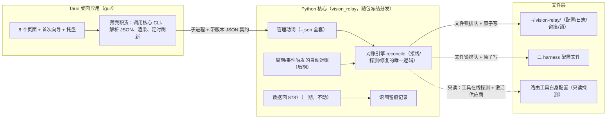

# vision-relay 二期设计 — 控制面：GUI · 配置对账 · 修复 · 一体化分发

> 日期：2026-08-21
> 前置：一期已实现并验收（[2026-08-13-vision-relay-design.md](2026-08-13-vision-relay-design.md)）
> 范围重划：本 spec 取代旧二期路线图（[2026-08-13-vision-relay-design-phase2.md](2026-08-13-vision-relay-design-phase2.md)）中的控制面项（Web UI、幽灵控制面、§12 自动探测）；其数据面项（磁盘缓存、跨协议流式、hooks、上游重试/总超时、OpenCode/DSH 接入）整体移三期
> 状态：设计稿（关键决策已与用户逐条确认，待审阅）
> 文体：需求说明书 —— 业务需求在前，设计思路从需求推导；实现方式与代码级参数留给实现计划（plans/）

---

## 1. 背景与动机

一期交付了数据面（8787 三协议代理、图片管线、fail-open）与最小 CLI。实际使用暴露三类问题：

1. **配置体验差**：模型看图能力的确认是终端问答（TUI），VLM 配置靠手改 JSON——门槛高、易错、不可视。
2. **接线是一锤子买卖**：harness 的 base_url 只在服务启停时改写。运行期间 CC Switch / Codex++ 开关路由、用户换供应商、手动编辑配置，代理都不感知——安全网被静默绕过。更糟的是服务异常中断后 base_url 残留指向死端口，**所有 harness 直接瘫痪，比没有安全网更糟**。
3. **安装分发是两件套**：Python 环境 + pip 安装对普通用户不可用。

同期确认的长期方向：**多 harness 信息拦截 / 提示词注入 / 统一调度平台长在 Python 核心里生长**（一期 IR 层是现成的插槽），GUI 永远只是管理壳。因此二期把投资集中在控制面，并留好插槽、不实现平台功能。

## 2. 需求清单

| # | 需求 | 来源 |
|---|---|---|
| R1 | 模型图片能力确认、VLM 配置、路由管理，从「终端问答 + 手改 JSON」变为桌面 GUI 操作（Windows / macOS / Linux） | 使用反馈 1 |
| R2 | 配置变更的感知与维持：服务运行期任何一方改了 harness 配置，代理要能发现并恢复正确接线——先做手动刷新，后做自动监听 | 使用反馈 2 |
| R3 | 服务意外中断后的残留接线，一键修复；修复目标必须可观测，且支持用户自定义回退档案 | 使用反馈 2 |
| R4 | 路由拓扑自动识别与维护：一层直连 / 两层经工具，自动探测已知路由工具并配好转发；真实上游尽力显示 | 一期 spec §12 设计的实施 + 使用反馈 |
| R5 | VLM 按 harness 分组配置（每组可用不同 VLM），带连通性测试 | 使用反馈 1 |
| R6 | 识图过程可观测：每次 VLM 调用的提示词、原始返回、实际注入文本可查 | 使用反馈（对账与信任） |
| R7 | 单一安装包分发：装完即用，零 Python 环境依赖（Windows MSI/EXE、macOS DMG、Linux AppImage/deb） | 使用反馈 3（硬约束） |
| R8 | 服务与 GUI 的生命周期语义显式化：GUI 内显式路由开关；关闭 GUI 弹确认（仅关界面 / 连服务一起关）；托盘常驻显示服务状态 | 使用反馈（普通用户预期） |

## 3. 术语与全局决策

- **模态表述统一为「图片 / image」**：能力值、UI 开关、文档措辞统一用「支持图片 / 纯文本」，消除「视觉」与 video 的歧义（模型模态 = 文本 / 图片 / 视频 / 语音）。配置层新值 `image`，旧值 `vision` 读兼容（不破坏现有 proxy.json）。泛化概念（「视觉安全网」、项目名 vision-relay、VLM = 视觉语言模型的通用叫法）保留。
- **平台方向**：拦截 / 注入 / 调度逻辑未来长在 Python 核心（IR 层 transformer 链插槽），三期另立 spec；GUI 永远是薄壳、可整体替换。
- **接线规则 = 始终接管**：服务运行期间，harness 的 base_url 一律指向本代理；路由工具的开关只决定本代理往哪转发（工具在线 = 两层经工具；离线 = 一层直连回落）。
- **幽灵控制面结案**：一期设计的 8788 控制 API 从未实现；本期以「不需要它」结案——GUI 通过核心 CLI 的 JSON 问答通信，`ui_port` 从配置与输出中移除，不新增第二个监听端口。
- **旧 spec 移交**：旧二期路线图加注记——Web UI 章节被本 spec 取代（方向从自包含网页改为 Tauri 桌面应用）；数据面项移三期。

## 4. 总体架构

**从需求推导出的架构规则：**

- R1–R8 全是管理面需求 → 管理逻辑全部长在 Python 核心（沿用一期已验证代码与测试体系），GUI 只是操作台。由此两条硬规则：**① GUI 与核心之间用稳定的、带版本号的 JSON 问答契约；② GUI 不自己解析任何配置文件**（哪怕只读展示也问核心，防止解析逻辑双语言漂移）。
- R2/R3/R4 本质是同一个问题——「实际接线状态」与「应有状态」不一致 → 核心里做**统一的对账引擎**，所有触发源（GUI 刷新按钮、自动监听、启停、诊断修复）走同一套规则。
- R7 要求单包 → 核心用冻结打包（含运行时的自包含程序）随 GUI 安装包分发，GUI 负责拉起/停止核心进程；GUI 与核心同包同版本。
- 一期数据面（协议归一化、图片管线、fail-open 不变量）**不动**；唯一的数据面增量是识图留痕（R6）。

**多写者现实与对策**（harness 配置文件有四个可能的写者：本代理、路由工具、供应商切换、用户手编。前三个争的都只有 base_url 一个字段，第四个偶尔整文件手改）：

- 严格的「排队」做不到（外部进程不受我们约束）→ 采用**期望状态 + 对账**模式（控制器思路）：
  1. **原子写**：所有写操作先写临时文件再一步替换，读者永远看不到半成品（一期已具备）；
  2. **自方排队**：本代理自己的写者（GUI 触发的动词、后台对账）之间用文件锁排队；
  3. **变更监听**：用操作系统文件通知（参考 CC Switch 的做法：事件通知 + 防抖 + 快照比对防自触发；Codex++ 的做法：每请求重读配置）感知外部改动，监听目标收窄为三个 harness 文件的 base_url 字段 + 本代理自身配置；
  4. **幂等对账**：实际 ≠ 期望就收敛，无漂移不碰文件。

## 5. 对账机制与接线规则

**期望状态**

- 服务运行中：每个启用的 harness，base_url 一律指向本代理（始终接管）；转发方向看工具：工具端口在线 → relay 指向工具（两层）；离线 → 一层直连回落，无可用直连 relay 时 GUI 明确警告「该 harness 当前无上游可用」。
- 服务停止：harness 恢复原状（备份或用户回退档案），自动添加的 relay 一并撤销。
- qwen-code 无路由工具，永远一层直连。

**观测信号（三个）**

1. 三个 harness 配置的 base_url 当前归属（本代理 / 已知工具端口 / 陌生地址）；
2. 已知路由工具的端口在不在线——只探端口通断，不做内容指纹（沿用一期「抗干扰」约束）；
3. 服务自身健康（进程存活 + 端口监听双信号，僵死 PID 自动清理）。

**对账规则矩阵**（唯一逻辑，所有触发源共用）

| 实际情况 | 处理 |
|---|---|
| 服务在跑，接线正确，relay 与工具状态一致 | 不动任何文件（幂等） |
| 服务在跑，harness 被工具改指工具端口 | 抢回：base_url → 本代理，relay 确认指向该工具；记录事件 |
| 服务在跑，工具路由关（端口离线） | base_url 保持本代理；relay 回落直连；无直连 relay 则警告 |
| 服务在跑，harness 被改成陌生地址（用户换供应商） | **吸收**：接管回本代理，同时把新地址记为该 harness 的直连上游；GUI 明确告知「检测到上游变为 X，已接管、转发已指向 X」，缺 key 则提醒补 |
| 服务已死，harness 仍指向本代理 | 进入修复流程 |
| harness 配置出现新模型 | 不碰 base_url；GUI 提醒批量确认图片能力 |

**备份、快照与回退语义**

- **接管组合快照**：每次接管（含对账吸收新上游）时，把该 harness 的 **base_url + API key 所在位置 + 模型名** 作为一组快照记档。动机：CC Switch 直连切换模式会把 live 文件回读进它自己的供应商档案——本代理写入的 8787 可能被它读走，造成其档案内「8787 + 别家 key/模型」的错位污染；本代理不写工具的库（只读硬约束），但凭快照始终持有「正确组合」的真相，任何还原都按组合写回，不受污染备份影响。
- **备份**只记「本代理第一次接管之前的原始值」，之后反复抢线不覆盖（防止备份被污染成本代理地址）；恢复即回到那个原始状态。
- **回退档案**：每个 harness 可在 GUI 保存一套用户期望的「默认回退组合」（base_url / key / 模型），修复时可选。
- 每次抢回 / 修复 / 吸收事件进事件日志（何时、哪个 harness、从什么改成什么），GUI 可查。

**修复流程（R3）**

先查服务状态；服务已死且接线仍指向本代理 = 事故。诊断面板把问题分**两类**：

- **可自动修复（确定性，无歧义）**：漂移抢回（服务运行中 base_url ≠ 本代理）、僵死 PID 清理——此类且仅此类进入「一键修复」。
- **需选择 / 补充信息**：僵尸接线（修复目标三选一，动手前展示：接管快照组合 → 显示具体 base_url+key+模型；按工具路由状态还原 → 工具在线写工具端口、工具也离线按快照组合写真实上游；我的回退档案 → 显示档案内容；或直接重启服务保持接管）；缺 API key（引导去配置，不代填）。

配套「直连连通性测试」诊断项：路由关闭（直连态）时，用各 harness 自己配置的 base_url + key 做轻量探测，帮助区分「问题本来就有」还是「本代理造成」。所有修复项提供「打开配置文件对应位置」快捷入口。

**路由工具档案（R4，一期 §12 清单的升级）**

每个已知工具一条档案：名字 + 默认端口 + **支持的 harness 矩阵** + 生成的 relay 模板 + **激活供应商读取方式**。注意 CC Switch 同时覆盖 Claude Code 与 Codex——某 harness 的第二跳归属（CC Switch 还是 Codex++）**以接管快照记录为准**，快照缺失时端口探测兜底，仍不明确则 GUI 询问一次并记住。真实上游的解析优先级：

1. 一层直连：relay 的 base_url 即答案（本代理配置，必然可得）；
2. 两层经工具：读工具自身的配置获得当前激活供应商及其 base_url（Codex++ 读其 settings.json；CC Switch 读其配置库，读不到退而调其端口上的状态接口）；
3. 都失败：诚实显示「由某工具决定（未知）」——不猜。

显示规则：**优先显示 base_url（端点），拿不到才退到供应商名 / 模型名**。工具探测全部只读，绝不写工具的配置。清单可扩展（TRAE / Kimi 等未来加条目即接入）。

**监听分阶段**：先手动刷新（GUI 按钮 + CLI 动词，本期必交付）；后自动监听（服务内文件通知 + 周期对账，可开关、默认开）。

## 6. GUI 设计（Tauri + React，导航 5 页 + 触发型首次向导）

交互布局参考（定稿线框 v2，浏览器直接打开、顶部标签仅为文档目录、页内可交互）：[gui-mockups/index.html](gui-mockups/index.html)。
信息架构原则（按用户反馈定稿）：**看编分离**——监控类页面只看 + 少数动作，编辑集中到「设置」与「模型能力」两处；导航从 8 页收敛为 5 页，降低学习成本。**保存语义统一**：所有输入类控件（含开关、勾选）一律经所在页底部统一「保存」生效并带未保存指示（设置页四分区共用一条保存栏）——只有按钮类动作（刷新配置、诊断、路由开关）即时生效。

| 页面 | 承载需求 | 要点 |
|---|---|---|
| 总览 | R2/R8 | ① 状态横幅：**滑动式路由开关**（启停服务+接线）、刷新配置（= 立即手动对账一次）、诊断与修复入口（**角标 = 未解决问题数**，修复完成才减少，点开不消耗）。② 三个 harness 拓扑卡：**竖排链路、动态渲染**——路由关则本代理节点置灰标注「已旁路」、连线右移直连下一跳；工具也关则再右移直连真实上游（demo 中可交互体验）。真实上游按 §5 优先级显示（优先 base_url）。③ 卡片「接线详情」抽屉（默认折叠）：配置文件路径与行、当前值 vs 期望值（**漂移由对账自动收敛，不设手动抢回按钮**——路由开着而 base_url ≠ 本代理即故障态，自动修）、接管组合快照、备份与回退档案。④ 待处理区（新模型批量确认入口、抢线事件；识图记录不在此处）。⑤ 诊断与修复**弹层**（带关闭）：问题分「可自动修复（确定性）/ 需选择或补充信息」两组，一键修复仅作用于前组；僵尸接线修复目标动手前可见（含按快照组合还原）；含直连连通性测试 |
| 模型能力 | R1 | 分组标签用全称（Claude Code / Codex / Qwen Code / relay）；表格：模型 / 来源 / 内置名单建议 / **支持图片 ⇄ 纯文本**；新模型高亮 + 批量操作（全部纯文本 / 全部支持图片 / 按内置名单建议）；**所有行随时可改**，一次保存生效（覆盖换供应商批量新模型场景） |
| 识图记录 | R6 | 一级按 harness、二级按会话（标识来自请求元数据，尽力而为；**会话短名**读 harness 会话目录的标题，读到显示短名、读不到显示截断 ID，不硬造；无标识归「未识别会话」）；单次明细：缩略图 + 哈希、①提示词（标注当前生效的是默认还是自定义）→ ②VLM 原始返回 → ③实际注入文本（如实显示预算截断）；留存与导出 |
| 事件日志 | R2/R3 | 抢回 / 吸收 / 接管 / 修复 / 异常退出事件流水（何时、从什么改成什么） |
| 设置 | R1/R5 + 全局配置 | 四分区：**服务**（监听地址、管理的 harness——即是否接管该 harness，与 relay 停用是两层概念、界面加说明、未知模型默认、自动监听开关与周期）；**VLM**（全局默认卡 + 按 harness 覆盖卡，字段带表头：模型名称 / base URL / API key / 协议；**识图提示词编辑器**：Tier1/Tier2 默认提示词可编辑保存、一键恢复默认；测试面板**四种模式**：Tier1×默认/自选提示词、Tier2×默认/自选，走生产调用路径；本页统一保存）；**上游转发**（relay = 「模型名匹配 → 转发上游」规则；**GUI 不提供手工新建**——全部自动生成：工具在线自动探测、接管/换供应商按快照吸收，避免向普通用户暴露「匹配模式」等转发配置概念；只读列表 + 图例 + 两个轻操作：停用转发（停用自动项记入压制名单）、缺 key 一键补填；完全自定义转发规则属高级用法，直接编辑 proxy.json 并在文档说明；工具档案卡：端口、支持的 harness、激活供应商及其 base_url、读取方式）；**高级**（识图留存策略与关闭、语言、版本与契约） |

**首次运行向导**（触发型弹层，不在导航；触发 = proxy.json 不存在，或存在但首次确认标志未置位；升级与新模型不重跑，走模型能力页增量确认）：扫描模型 → 批量确认图片能力 → 配置 VLM 并测试 → 完成后才允许开启路由。原终端向导保留（无 GUI 场景）。

**生命周期语义（R8）**：路由开关 = 启停服务 + 接线/还原；GUI 关闭弹确认（「仅关闭界面，服务继续」/「关闭界面并停止服务」，可记住选择）；系统托盘常驻显示服务状态，支持快捷启停。

## 7. 配置与数据变更

1. **VLM 按 harness 分组**：新增按 harness 的 VLM 配置组；现有全局段降为默认兜底，未配置的组回落全局。
2. **能力值术语**：新值 `image`，旧值 `vision` 读兼容；所有新 UI / 文档用「支持图片 / 纯文本」。
3. **接管组合快照、备份与回退档案**：见 §5。
4. **识图提示词可自定义**：Tier1/Tier2 默认提示词可在 GUI 编辑、保存、一键恢复默认；识图管线读取当前生效值；测试面板支持默认/自选提示词 × Tier1/Tier2 四种组合。
5. **relay 压制名单**：用户停用自动探测生成的 relay = 显式意图，记入压制名单，自动探测不再加回。
6. **识图留痕**：本地留存（默认 7 天、可关闭）；记录含提示词与原始返回，属敏感数据，只存本机、不随任何上报外发。
7. **移除 `ui_port`**：配置、CLI 输出、check 全部清理（含一期 spec 中相应表述的勘误注记）。

## 8. 分发与安装（R7）

- **单一安装包**：GUI + 冻结核心同包（Windows MSI/EXE、macOS DMG 拖拽安装、Linux AppImage/deb），安装即用、零 Python 依赖；GUI 管理核心进程的拉起与停止。
- **一个版本号**：同包同版本发布；JSON 契约带版本字段，兼容「用户单独升级了 pip 版核心」的残余场景（GUI 检测到不匹配给升级指引，不莫名报错）。
- **pip 通道保留**：高级用户 / 无界面场景（CI、服务器）仍可 `pip install vision-relay` 纯 CLI 使用。
- 已知代价（记档，不阻断）：安装包约 50–80MB；冻结程序偶发杀毒软件误报（缓解手段在实现计划中评估）；暂不做签名 / 公证。

## 9. 风险与优先级

| 级别 | 事项 | 说明与要求 |
|---|---|---|
| **P0** | 配置双写冲突 | GUI 与常驻服务同时改同一批文件会互相覆盖丢改动。要求：自方写者全局排队（文件锁）+ 原子写 + 每次改动留痕 |
| **P0** | 僵尸接线 | 服务异常中断后 harness 指向死端口，全部 harness 瘫痪。要求：任何时候可检测、可一键修复、修复目标可观测 |
| **P0** | 单包分发 | 硬约束（R7），决定技术路径（冻结打包 + sidecar） |
| **P0** | 对账引擎 | 所有接线变更的唯一通道，规则矩阵见 §5 |
| **P1** | 外部变更监听 | 文件通知 + 防抖；只盯 base_url 与本代理配置；幂等对账 |
| **P1** | 外部工具档案污染 | CC Switch 直连切换会把 live 文件回读进其供应商档案，本代理写入的 8787 可能被存成「8787 + 别家 key/模型」的错位组合。对策：接管组合快照（§5）保住正确组合的真相；绝不写工具的库 |
| **P1** | 抢线窗口 | 工具改写 base_url 到本代理发现之间的短窗口图片可能漏过。接受窗口存在；每次纠正留事件日志；无漂移不写文件 |
| **P1** | GUI/服务生命周期 | 显式开关、关闭确认、托盘（R8） |
| **P1** | 新模型提醒 | 批量确认入口 |
| **P1** | 契约版本 | 防 GUI 与核心版本脱节 |
| **P2（下期/按需）** | 签名 / 公证、安装包体积优化、状态推送流 | — |

## 10. 测试与验收

- **Python 核心**：管理动词单元测试；对账规则矩阵测试（模拟四类漂移：被工具改走 / 工具离线 / 陌生地址吸收 / 僵尸接线修复）；识图留痕与留存清理；锁与原子写。
- **契约测试**：全部 `--json` 输出的结构稳定性（GUI 与核心不脱节的护栏）。
- **GUI**：三平台手工测试手册（沿用一期 manual-test 惯例）；打包冒烟（安装 → 起服务 → 开关路由 → 修复）。
- **端到端验收剧本**：
  1. 开启 / 关闭路由（开关、接线、还原全程正确）；
  2. 强杀服务进程 → 诊断面板发现僵尸接线 → 一键修复，修复目标全程可见；
  3. CC Switch / Codex++ 运行期开关路由 → 自动抢回 / 回落直连，事件留痕；
  4. 换供应商（base_url 变陌生地址）→ 吸收为新直连上游 + 新模型批量确认；
  5. 按 harness 配置不同 VLM 并各自测试通过；
  6. 识图记录按 harness → 会话归档，三段内容（提示词 / 原始返回 / 注入文本）可查；
  7. 关闭 GUI（选「仅关界面」）服务存活，托盘可见并可启停。

## 11. 排期里程碑

| 里程碑 | 内容 | 交付判据 |
|---|---|---|
| **M1 核心** | 管理动词 `--json` 全套、对账引擎、工具档案与自动探测、修复、文件锁、识图留痕、`image` 术语与 VLM 分组（配置层） | 命令行层面刷新 / 修复 / 诊断全部可用（「刷新优先做」在此落地） |
| **M2 GUI** | Tauri 壳 + 8 页面 + 首次向导 + 托盘与关闭确认 | 端到端剧本 1–7 手工跑通 |
| **M3 监听 + 打包** | 自动对账（可开关）、留存策略生效、三平台安装包 CI、一体化发布 | 单安装包三平台「装完即用」验收 |

## 12. 明确不做（本期范围外 → 三期）

- 多 harness 拦截 / 注入 / 调度平台（IR 层 transformer 链——本 spec 只留插槽方向：注入类变换未来挂在 IR 层，不另开解析路径）；
- 新 harness 接入（OpenCode、DSH、TRAE、Kimi）、DSH 准入声明；
- 磁盘缓存、后台深缓存、跨协议流式（Responses ↔ 其他）、Claude Code hooks、上游转发重试、请求级总超时；
- relay 多供应商轮转、服务端部署、签名 / 公证。

## 13. 决策记录（2026-08-21 与用户逐条确认）

| 决策点 | 结论 |
|---|---|
| 二期范围 | 聚焦控制面（GUI + 对账 + 修复 + 自动探测 + 打包）；数据面增强全部移三期 |
| GUI 技术栈 | Tauri + React（UI 质量与生态优先；两参考项目同栈；GUI 是薄壳、可整体替换） |
| 平台方向 | Python 核心生长；GUI 永远是管理壳；未来平台功能长在核心 IR 层 |
| GUI↔核心通信 | 核心管理动词 `--json` 子进程契约；不实现 8788 控制 API；移除 `ui_port` |
| 代码布局 | 同仓库 monorepo（`gui/` 目录）；GUI 与核心同版本发布 |
| 接线规则 | 始终接管（服务运行期间 base_url 一律指向本代理；工具开关只决定 relay 指向） |
| 多写者机制 | 期望状态 + 对账（原子写 / 自方文件锁 / 文件通知监听 / 幂等收敛），不做跨进程排队 |
| 修复语义 | 先查服务状态；问题分「确定性自动修复」与「需选择/补充信息」两类，一键修复仅作用于前者；修复目标动手前可见（接管组合快照 / 按工具路由状态还原 / 用户回退档案，三选一） |
| 接管组合快照 | 接管时记 base_url + key 位置 + 模型的组合，防外部工具档案污染造成的错位；第二跳归属（CC Switch 也可能路由 Codex）以快照为准、探测兜底 |
| 真实上游显示 | 直连 = relay base_url；两层 = 读工具激活供应商（Codex++ settings.json / CC Switch 配置库 / 状态接口）；都失败诚实显示未知；优先显示 base_url |
| VLM 分组 | 按 harness（入站协议判组）+ 全局兜底 |
| 识图记录 | 一级 harness / 二级会话（尽力识别，短名读 harness 会话目录、读不到显示截断 ID）；三段明细；本地留存 7 天可关闭 |
| 识图提示词 | Tier1/Tier2 默认提示词可在 GUI 自定义、保存、一键恢复默认；测试支持默认/自选 × Tier1/Tier2 四种模式 |
| GUI 信息架构 | 导航 5 页（总览 / 模型能力 / 识图记录 / 事件日志 / 设置四分区）+ 触发型首次向导；看编分离；漂移由对账自动收敛，不设手动抢回按钮；诊断角标 = 未解决问题数；拓扑链动态渲染（旁路节点置灰、连线右移） |
| relay 的 GUI 边界 | GUI 不提供手工新建 relay：来源仅自动探测 + 快照吸收，界面只读 + 停用转发 + 补 key；自定义转发规则的高级用户直改 proxy.json（文档说明） |
| 保存语义 | 输入类控件一律页底统一保存（未保存有指示，设置页四分区共用一条保存栏）；仅按钮类动作（刷新/诊断/路由开关）即时生效 |
| 模态术语 | 统一「图片 / image」；配置值 `image`（读兼容 `vision`）；泛化概念保留 |
| 分发 | 单一安装包（冻结核心随包）；pip 保留为高级通道 |
| GUI 生命周期 | 显式路由开关 + 关闭确认二选一 + 托盘常驻 |
