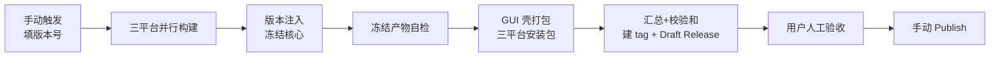

# vision-relay 二期 M3 设计 — 三平台打包发布 · 留存清理 · Minor 清账

> 日期：2026-08-26
> 前置：二期控制面设计（[2026-08-21-vision-relay-phase2-control-plane-design.md](2026-08-21-vision-relay-phase2-control-plane-design.md)）M1/M2 已交付，本 spec 落地其 §8 分发与安装（R7）与 §11 M3 里程碑；事项汇总见 [2026-08-26-vision-relay-phase2-m3-consolidation.md](../../2026-08-26-vision-relay-phase2-m3-consolidation.md)
> 状态：设计稿（关键决策已与用户逐条确认，待审阅）
> 文体：需求说明书 —— 业务需求在前，设计思路从需求推导；流水线步骤编排、脚本与文件落点等实现细节留给实现计划（plans/）

---

## 1. 背景与动机

M1（命令行刷新/诊断/修复/探测）与 M2（GUI 端到端剧本）已交付，Python 侧 548 个测试全绿。距「二期收尾、发布首个公开版本 v1.0.0」还差三件事：

1. **分发仍是两件套**：用户要自备 Python 环境 + pip 安装，GUI 壳靠 PATH 找核心命令。R7 硬约束（单一安装包、装完即用、零 Python 依赖）未落地。
2. **打包完全手工**：没有云端流水线能产出三平台安装包；现有 CI 只覆盖测试矩阵与 wheel 冒烟。
3. **两笔小账未清**：识图留痕的清理能力已实现但从未生效（留痕无限堆积，对不上设置页「7 天·可关闭」的承诺）；验收记档的 Minor M1–M8 未修。

本期（M3 收尾）以**发布流水线**为核心，连带清掉小账，交付 v1.0.0。

## 2. 需求清单

| # | 需求 | 来源 |
|---|---|---|
| R1 | 云端一键三平台打包：**手动触发**的发布流水线，产出 Windows / macOS / Linux 安装包并自动挂到 Release | M3 里程碑（二期 §11）；用户额度约束（只有确认过的才跑 CI） |
| R2 | 装完即用单包：R7 硬约束落地——GUI 与冻结核心同包、零 Python 依赖 | 二期 §8 |
| R3 | 版本一致：GUI 壳、核心、发布 tag 三者同版本；发布动作不依赖日常手改版本号 | 二期 §8「一个版本号」 |
| R4 | 识图留痕留存策略生效：过期自动清理、可关闭 | 二期 §7、M3 汇总 B |
| R5 | 验收记档的 Minor 问题清账（M1–M8） | 手工验收记档 |
| R6 | GUI 侧纳入 CI 门禁；Issue / PR 模板按现状修订 | 参考项目调研（cc-switch / CodexPlusPlus / MultiAgents-Manager） |
| R7 | README（双语）与 CHANGELOG 更新至项目现状；README 展示 GUI 界面截图 | 发版门面；CHANGELOG 1.0.0 小节是发布说明正文的直接来源（§4） |
| R8 | 首版**实发布**：v1.0.0 在云端真实走完「触发 → 构建 → Draft → 人工验收 → Publish」全流程，作为流水线的端到端验收 | 用户决策：M3 无功能面变化（打包 + 小修），无功能障碍，直接以实发验证 |

## 3. 全局决策（2026-08-26 与用户逐条确认）

| # | 决策 | 要点 |
|---|---|---|
| D1 | 打包形态 | 完整 R7：三平台 GUI 安装包（Windows 安装 exe / macOS DMG / Linux AppImage+deb），内嵌冻结核心 |
| D2 | 触发方式 | 仅手动触发（额度有限，push / PR / tag / 定时一律不自动跑 CI）；触发时填版本号 |
| D3 | 产物落地 | 三平台全部构建成功 → 自动建 tag + **Draft Release** 挂全部产物 → 用户人工检查后手动 Publish |
| D4 | 冻结形态 | 冻结核心以**目录形态**随包分发。理由：GUI 状态轮询每 5 秒拉起一次核心，单文件形态每次 0.5–2s 解压延迟会被放大成 GUI 发滞，且杀毒误报风险更高 |
| D5 | 版本号 | 首版 **v1.0.0**（二期完整迭代 + 测试全绿 + 手工验收，功能面稳定）；后续小修 1.0.x、自动对账等新功能 1.1 |
| D6 | M3 范围裁剪 | 留存清理本期生效；**自动对账（周期触发/文件监听）推后**——完全未实现、工作量大，且手动刷新已可用，不阻塞发版 |
| D7 | Minor 清账 | M1–M8 除 M2（非 bug）外全修；工作区已完成的「停用转发」修复（suppressed_relays）先行入库 |
| D8 | 截图自产，不要用户提供图 | 真实 GUI + **隔离测试配置（假数据）**下截取——保证界面真实、入镜数据无害 |
| D9 | 首版发布即实战验收 | 流水线首次运行就是 v1.0.0 实发布（R8）；不做「先跑一版假版本演练」——失败不产 tag/Release、重跑零成本的失败语义（§4）让演练没有必要 |

## 4. 发布流水线（R1）

**行为语义**：

- **触发**：仅手动，输入版本号（语义化三段式，输入不合法当场拒绝）。
- **三平台并行**，任一失败整次运行失败——**不建 tag、不建 Release**，修正后重跑零成本。这是选「手动触发填版本」而非「发布动作触发构建」模式的核心依据（后者构建失败需删 Release 重来）。
- **每平台的职责链**：版本注入 → 冻结核心 → 冻结产物自检（能启动、报出正确版本号）→ GUI 壳打包安装包 → 产物上传。
- **汇总发布**：三平台全绿后汇总全部产物与校验和文件，创建 tag 与 **Draft Release**；说明正文取自 CHANGELOG 对应版本小节（缺失用兜底文案）。
- **产物构成与命名**：每平台安装包命名含版本、平台、架构，一眼可辨。
- **不做**：签名 / 公证 / 自动更新（二期 P2 记档）。

## 5. 单包分发落地（R2）

- **冻结**：核心以冻结目录形态与 GUI 壳同包分发（D4）；版本在冻结前注入，目标机零 Python 依赖。
- **GUI 壳找核心的顺序**（行为语义）：
  1. **用户显式路径**（现状保留——用户显式选择高于一切）；
  2. **包内冻结核心**（新增）——正式安装形态；
  3. **PATH 上的核心命令**——开发模式（GUI 源码调试）自然落此，开发体验不变。
- **兼容性承诺**：pip 通道保留（二期 §8，高级用户/无界面场景纯 CLI 可用）；PATH 上已装有核心的机器，GUI 照常可用，与安装包互不冲突。
- **macOS 架构**（风险项，两级退路）：首选 **universal2**（一份 DMG 双架构通吃，macOS 构建机计费倍率最高，只跑一份）；不可行降级 **aarch64-only**（覆盖绝大多数目标用户）；再不行 **分架构双 DMG**（参考 CodexPlusPlus 模式）。降级不阻塞发版，选择记入发布说明。
- **已知代价**沿用二期 §8 记档：安装包约 50–80MB；冻结程序偶发杀毒误报（发布说明附缓解指引）；暂不签名不公证。

## 6. 版本一致性（R3）

- **发布时 tag 是版本唯一事实源**：构建过程将版本号写入核心与 GUI 壳（写入位置与工具归实现计划）。
- **代码库日常保持开发态版本**：发版不要求提交前手改版本号。
- **一致性可断言**：安装包内 GUI 显示版本、冻结核心 `--version` 输出、Release tag 三者一致，流水线自检覆盖。

## 7. 留存清理生效（R4）

- 服务启动即清理一次，此后周期性重复（默认周期 24 小时）。
- **「识图留痕」关闭时完全不清理**——对应设置页「可关闭」承诺。
- 清理绝不影响代理主链路（fail-open 铁律：清理失败静默、转发照常）；清理量入事件日志。
- 行为要求：过期记录删除、未过期保留；关闭时不删任何东西。

## 8. Minor 清账（R5）

**前置**：工作区已完成的「停用转发」修复（含测试，已绿）先行提交入库。

| 项 | 现象（验收记档） | 期望行为 |
|---|---|---|
| M1 | zcode-restart 停止成功但重启失败时无 UI 反馈，提示条可能消失 | 重启失败可见（提示转错误态或等效反馈），不静默消失 |
| M3 | 无 baseURL 的供应商在统计里隐身 | 统计如实纳入，标注「未接线」类状态 |
| M4 | Settings「保留勾选」后复选框状态不回滚，再保存会再弹窗 | 选择后复选框与已保存状态一致，不再重复弹窗 |
| M5 | 模态门还原后模型级 `zcode:{}` 空壳残留 | 还原后无空壳残留（仅清注入物，不动用户数据） |
| M6 | 核心代码注释引错 spec 章节 | 引用正确 |
| M7 | zcode 探测无目标时 reason 文案不准确 | 文案与实际原因一致 |
| M8 | `tmp_icons/` 未入忽略清单，全仓 ruff 恒红 | 忽略后 ruff 恢复干净 |
| M2 | bisect 中间态测试红 | **非 bug，不修**，仅记档 |

每项按仓库规则配测试（GUI 项 vitest / 核心项 pytest），行为变化同步更新对应 spec。

## 9. CI 门禁与仓库配套（R6）

- **门禁增强**：现有手动触发的测试矩阵（3 系统 × 4 Python + wheel 冒烟）不动；新增 GUI 门禁项——前端测试、类型检查、GUI 壳编译检查，仍仅手动触发。
- **模板修订**（一期脚手架已有 bug / feature Issue 模板与 PR 模板，本期补齐缺口，不推倒重来）：
  - bug 报告模板：补操作系统字段、harness 清单纳入 zcode、诊断报告**脱敏指引**（粘贴前去除 key）；
  - PR 模板：检查清单补前端测试与构建项、行为变化同步更新 `docs/superpowers/specs/` 对应 spec 项。
- **不抄记档**（参考项目取舍，理由见调研）：stale（定时任务白耗额度）、labeler、AI triage、CDN 同步、多语言模板、dependabot / CODEOWNERS / FUNDING（单人维护 + 手动 CI 下无收益）。

## 10. 文档与发布材料（R7）

- **README 双语更新**：现稿只讲一期数据面（代理原理），需补控制面全貌——GUI 控制台、四个 harness（Claude Code / Codex / Qwen Code / zcode）、对账与自动修复、识图留痕；安装方式新增「下载安装包」（v1.0.0 Release 链接），pip 通道保留。中英两份同步。
- **界面截图（D8）**：以隔离测试配置（虚构供应商与模型，无真实 key / 端点 / 模型名）驱动真实 GUI 截取——总览、模型能力、识图记录等代表页；截图文件入库存放（具体目录归计划），README 引用相对路径。
- **CHANGELOG 出 1.0.0 小节**：把 `[Unreleased]` 中已交付内容整理为 `[1.0.0]` 条目（一期数据面 + 二期控制面全量特性 + 本期修复）。**这是发布的硬前置**——发布说明正文取自该小节（§4），缺失即兜底文案，不能接受。

## 11. 首版实发布（R8）

流程即验收（D9——不演练，直接实发）：

1. 全部工作合入 main 并推送（手动触发的 workflow 必须在默认分支上才可从 Actions 页触发）；
2. Actions 页手动触发发布流水线，填 `1.0.0`；
3. 三平台全绿 → Draft Release `v1.0.0` 自动出现（正文 = CHANGELOG 1.0.0 小节，产物 = 三平台安装包 + 校验和）；
4. **人工验收闸门**：本机 Windows 下载安装包走「装完即用」剧本（A3）——装 → GUI 起 → 开路由 → 诊断报告；macOS / Linux 产物存在性确认（实机回归记档后补）；
5. 验收通过 → 手动 Publish；README 安装包链接指向该 Release。

**失败处理**（按阶段）：

| 阶段 | 现象 | 处置 |
|---|---|---|
| 构建中 | 任一平台 job 失败 | 不产 tag / Release；修复提交后重跑，零残留 |
| Draft 已出、验收发现问题 | 需要改代码 | 删 Draft 与 tag → 修复提交 → 重跑同版本号 |
| 已 Publish 后发现问题 | — | 发 1.0.1（不删已发布版本） |

## 12. 验收标准

| # | 验收项 | 判据 |
|---|---|---|
| A1 | 一键构建 | 手动触发填 `1.0.0` → 三平台全绿 → Draft Release `v1.0.0` 自动出现，挂全部产物与校验和 |
| A2 | 版本一致 | 安装包内 GUI 显示版本、冻结核心 `--version`、Release tag 三者均为 1.0.0 |
| A3 | 装完即用（Windows，本机主验收） | 无 Python 的干净环境装包 → GUI 起 → 开路由 → 诊断报告正常 |
| A4 | 零 PATH 依赖 | 安装后 PATH 无核心命令，GUI 全功能走包内核心 |
| A5 | 留存生效 | 造过期留痕 → 起服务 → 过期被清、未过期保留；「识图留痕」关闭时不清理 |
| A6 | Minor 清账 | M1/M3/M4/M5/M6/M7/M8 逐项复验通过；测试全绿；ruff 干净 |
| A7 | CI 门禁 | 手动跑 CI：测试矩阵 + GUI 门禁全绿 |
| A8 | 发布流程 | Draft 检查 → 手动 Publish → Release 页可下载全部产物；杀毒误报与体积记档观察不阻断 |
| A9 | 文档门面 | README 双语反映项目全貌、截图正常显示且**入镜无真实供应商信息**；CHANGELOG 有 1.0.0 小节且与发布说明正文一致 |
| A10 | 实发布 | v1.0.0 Release 已 Publish，三平台安装包 + 校验和可下载；README 安装链接指向该 Release |

macOS / Linux 实机回归（M3-D）不阻塞发布：Draft 阶段按现有环境能验多少验多少，剩余记档后补。

## 13. 风险与缓解

| 风险 | 影响 | 缓解 |
|---|---|---|
| macOS universal2 冻结不可行 | DMG 架构覆盖缩水 | 两级退路（§5），降级不阻塞发版 |
| Windows 打包素材不齐（图标等） | 打包失败 | 实现计划首步验证；图标工作收尾兜底 |
| 包内核心路径三平台解析差异 | 找不到包内核心（回退 PATH，用户无感但违背 A4） | 用平台官方资源解析机制 + 三平台流水线自检断言 |
| 冻结程序杀毒误报 | 用户侧误报拦截 | 二期已记档已知代价；发布说明附缓解指引 |
| 冻结工具链与 Python 版本兼容意外 | 构建失败 | CI 即时暴露、重跑零成本；锁定已验证版本 |

| 截图入镜敏感信息 | README 公开泄露真实供应商端点 / 模型 / key | 隔离测试配置 + 假数据（D8）；截图入库前人工过目 |
| 首发流水线首次实跑即实战 | 失败暴露在真发版上 | 失败不产 tag / Release、重跑零成本（§4）；失败处置表见 §11 |

## 14. 决策记录

| 决策点 | 结论与理由 |
|---|---|
| 手动触发 vs 发布动作触发 | 两者都满足「确认过才跑 CI」；手动触发失败重跑成本更低（发布触发构建失败需删 Release 重来），版本号输入可控。额度优先 |
| Draft 而非直接发布 | 发布前保留人工检查产物的最后一道闸（D3） |
| 冻结目录形态 vs 单文件 | GUI 高频轮询拉起核心的使用模式下，单文件的解压延迟与误报风险双重不可取（D4） |
| tag 为版本唯一事实源 | 避免多处版本号手改漂移；日常开发态版本不随发版变化 |
| 自动对账推后 | 核心价值（打包发布）不被非阻塞项拖住；手动刷新 M1/M2 已可用（D6） |
| 冻结核心不进 PATH | 安装包自包含（A4）；PATH 上的 pip 版核心仍可被探测顺序兜底，不冲突 |
| 模板取舍 | 一期已有模板修订补齐（OS / zcode / 脱敏指引 / vitest / spec 同步项），不推倒重来；不抄定时类与单人维护无收益的大库配置 |
| 截图自产 | 真实 GUI + 隔离假数据配置截取（D8），不依赖用户提供图；入库前人工过目 |
| 首发即实发 | 失败语义（不产 tag / Release）使演练冗余；实发是最真实的端到端验收（D9 / R8） |

## 15. 明确不做（本期范围外）

自动对账周期触发与文件监听（下版）、签名 / 公证 / 自动更新（P2）、安装包体积优化、多语言发布说明与用户手册、dependabot / CODEOWNERS / stale / labeler、CDN / 发布渠道同步、flatpak / rpm 包装、模型探测与路由功能变更（数据面不动）。
